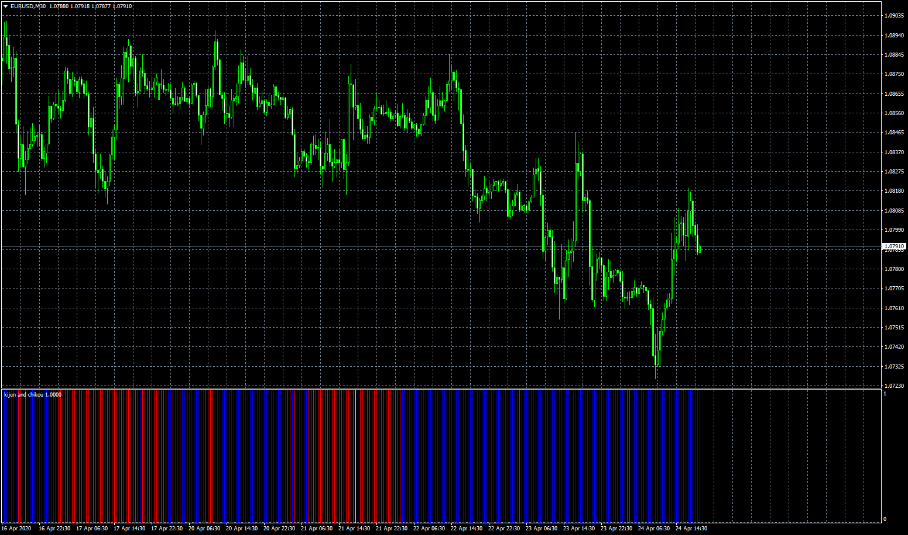

# kijun and chikou heatmap

> Source: https://fxcodebase.com/code/viewtopic.php?f=38&t=69731  
> Forum: 38 · Topic 69731 · 8 post(s)

---

## kijun and chikou heatmap

**Apprentice** · Fri Apr 24, 2020 1:24 pm

Based on request.
[viewtopic.php?f=27&t=69714](https://fxcodebase.com/code/viewtopic.php?f=27&t=69714)

 [kijun and chikou heatmap.mq4](files/133173/kijun%20and%20chikou%20heatmap.mq4)

---

## Re: kijun and chikou heatmap

**zero999** · Fri Apr 24, 2020 7:12 pm

I need to shift it backwards(26)

---

## Re: kijun and chikou heatmap

**Apprentice** · Sat Apr 25, 2020 1:25 am

Your request is added to the development list.
Development reference 1144.

---

## Re: kijun and chikou heatmap

**Apprentice** · Fri May 01, 2020 9:53 am

Try this version.

 [kijun and chikou heatmap with shift.mq4](files/133435/kijun%20and%20chikou%20heatmap%20with%20shift.mq4)

---

## Re: kijun and chikou heatmap

**zero999** · Sun May 03, 2020 10:39 am

> **Apprentice wrote:**
>
>
> kijun and chikou heatmap with shift.mq4
>
>
> Try this version.

when i place shift=0 indicator draw last 26 bar.please delete last 26 histogram to fix this bug
thank you

---

## Re: kijun and chikou heatmap

**Apprentice** · Sun May 03, 2020 3:56 pm

Try this version.

---

## Re: kijun and chikou heatmap

**zero999** · Mon May 04, 2020 11:03 am

> **Apprentice wrote:**
> Try this version.

Which version?

---

## Re: kijun and chikou heatmap

**Apprentice** · Tue May 05, 2020 4:28 am

Updated version of kijun and chikou heatmap with shift.mq4
Fri May 01, 2020 4:53 pm post.
