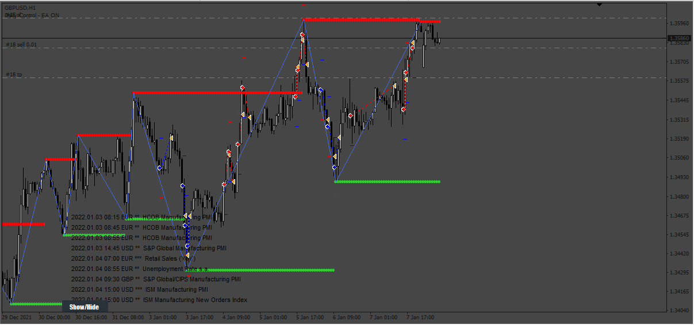

# KISS_Auto_Fib_btn / Zigzag_v.2_3_btn / ZigZag_Triad_MTF_Aler

> Source: https://fxcodebase.com/code/viewtopic.php?f=38&t=74097  
> Forum: 38 · Topic 74097 · 6 post(s)

---

## KISS_Auto_Fib_btn / Zigzag_v.2_3_btn / ZigZag_Triad_MTF_Aler

**Apprentice** · Wed Aug 30, 2023 12:30 pm

Based on the request.
[https://fxcodebase.com/code/viewtopic.php?f=27&p=152121](https://fxcodebase.com/code/viewtopic.php?f=27&p=152121)

 [KISS_Auto_Fib_btn.mq4](files/152309/KISS_Auto_Fib_btn.mq4)

 [Zigzag_v.2_3_btn.mq4](files/152309/Zigzag_v.2_3_btn.mq4)

 [ZigZag_Triad_MTF_Alerts_3_btn.mq4](files/152309/ZigZag_Triad_MTF_Alerts_3_btn.mq4)

---

## Re: KISS_Auto_Fib_btn / Zigzag_v.2_3_btn / ZigZag_Triad_MTF_

**Sensible** · Thu Aug 31, 2023 10:46 pm

Hi,

 Thanks for adding Button on these three indicators But my challenge is the button are overriding each other, is there no way to make the three buttons appear separate on the chart because It is only the last indicator button added that can be off/on the first two no button to off/on it on the chart.

 Pls make the button for each indicators appear separately on the chart

---

## Re: KISS_Auto_Fib_btn / Zigzag_v.2_3_btn / ZigZag_Triad_MTF_

**Apprentice** · Sat Sep 02, 2023 4:45 am

You can change the position of the individual button position.

---

## Re: KISS_Auto_Fib_btn / Zigzag_v.2_3_btn / ZigZag_Triad_MTF_

**Appu264** · Sat Sep 09, 2023 6:11 am

Can EA BASED ON THIS ZIGZAG INDICATOR MTF
CLOSE ON OPPOSITE SIGNAL
GREEN MARK TO BUY
RED MARK TO SELL
ADD NEWS FILLTER
Add tp sl and tsl
CLOSE ALL TRADE BEFORE 15MINS OF NEWS
ENABLE EA AFTER 30MINS

---

## Re: KISS_Auto_Fib_btn / Zigzag_v.2_3_btn / ZigZag_Triad_MTF_

**Apprentice** · Sun Sep 10, 2023 2:21 pm

We have added your request to the development list.
Development reference 812.

---

## Re: KISS_Auto_Fib_btn / Zigzag_v.2_3_btn / ZigZag_Triad_MTF_

**Apprentice** · Sat Sep 16, 2023 4:21 am

 [ZIg_Zag_MTF_EA.mq4](files/152596/ZIg_Zag_MTF_EA.mq4)
