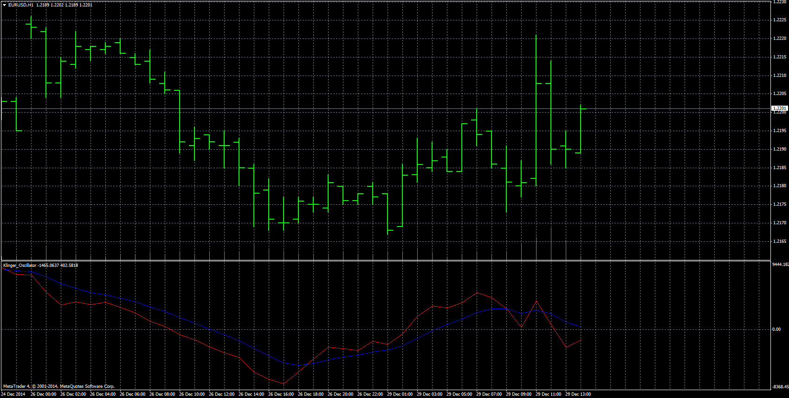

# Klinger Oscillator

> Source: https://fxcodebase.com/code/viewtopic.php?f=38&t=61644  
> Forum: 38 · Topic 61644 · 9 post(s)

---

## Klinger Oscillator

**Apprentice** · Mon Dec 29, 2014 6:46 am

The description of the indicator from investopedia ([http://www.investopedia.com/terms/k/kli ... llator.asp](http://www.investopedia.com/terms/k/klingeroscillator.asp))

A technical indicator developed by Stephen Klinger that is used to determine long-term trends of money flow while remaining sensitive enough to short-term fluctuations to enable a trader to predict short-term reversals. This indicator compares the volume flowing in and out of a security to price movement, and it is then turned into an oscillator.

A signal line (13-period moving average) is used to trigger transaction decisions. This technique is very similar to signals that are created with other indicators such as the 'moving average convergence divergence'.

The Klinger Oscillator also uses divergence to identify when price and volume are not confirming the direction of the move. It is considered to be a bullish sign when the value of the indicator is heading upward while the price of the security continues to fall. Traders will use other tools such as trendlines, moving averages and other indicators to confirm the reversal.

**MT4 Versions**

 [Klinger Oscillator.mq4](files/97906/Klinger%20Oscillator.mq4)

 [Klinger Volume Oscillator Cumulative.mq4](files/97906/Klinger%20Volume%20Oscillator%20Cumulative.mq4)

 [Klinger Oscillator Alert.mq4](files/97906/Klinger%20Oscillator%20Alert.mq4)

**MT5 Versions**

 [Klinger_Oscillator.mq5](files/97906/Klinger_Oscillator.mq5)

 [Klinger_Volume_Oscillator_Cumulative.mq5](files/97906/Klinger_Volume_Oscillator_Cumulative.mq5)

 [Klinger_Oscillator_Alert.mq5](files/97906/Klinger_Oscillator_Alert.mq5)

---

## Re: Klinger Oscillator

**logicgate** · Tue Jul 20, 2021 6:59 am

Hi there buddy, can we get a MT5 version of those indicators?

Thanks

---

## Re: Klinger Oscillator

**Apprentice** · Wed Jul 21, 2021 12:20 am

Your request is added to the development list.
Development reference 671.

---

## Re: Klinger Oscillator

**Apprentice** · Tue Jul 27, 2021 3:21 am

MT5 Versions added.

---

## Re: Klinger Oscillator

**logicgate** · Fri Jul 29, 2022 7:04 am

> **Apprentice wrote:**
> MT5 Versions added.

MT5 version is not working buddy, the indicator window is empty, no data.

---

## Re: Klinger Oscillator

**logicgate** · Sun Jul 31, 2022 11:51 am

> **Apprentice wrote:**
> MT5 Versions added.

MT5 version has error during compilation, line 118 "void returns a function" something like that

---

## Re: Klinger Oscillator

**Apprentice** · Tue Aug 02, 2022 4:54 am

We have added your request to the development list.
Development reference 456.

---

## Re: Klinger Oscillator

**richard19** · Thu Nov 17, 2022 9:55 pm

Hi Apprentice

Is it possible to have "max bar" option for Klinger Osc MQ4, not the cumulative?

Want to limit the number of bars shown on the screen. This will help with CPU resources.

Thank you

Richard.

---

## Re: Klinger Oscillator

**Apprentice** · Thu Jan 23, 2025 4:55 pm

[Klinger_Oscillator.mq5](files/157991/Klinger_Oscillator.mq5)

Try this version.
