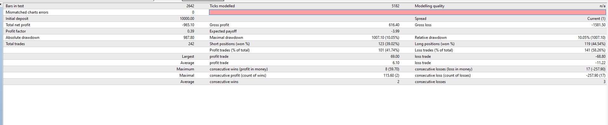

# !koral EA

> Source: https://fxcodebase.com/code/viewtopic.php?f=38&t=68729  
> Forum: 38 · Topic 68729 · 9 post(s)

---

## !koral EA

**Apprentice** · Wed Jul 31, 2019 6:12 am

Based on request.
[viewtopic.php?f=27&t=68718](https://fxcodebase.com/code/viewtopic.php?f=27&t=68718)

 [!koral EA.mq4](files/127653/koral%20EA.mq4)

Make sure to install !koral.mq4

 [!koral.mq4](files/127653/koral.mq4)

---

## Re: !koral EA

**Sp2562** · Wed Jul 31, 2019 10:25 pm

Hi friend

According to the photo, there are two purchase orders, but the red averages continue, this is a mistake.

As averages intersect and colors change, the order must be closed and opened (with confirmation of a candle).

example:

blue buy, close buy order when the medians cross and turn red, with crossover confirmation to open the sell order for the current candle end (if you do not confirm the crossover until the current candle end expires, keep the buying position).

red sell, close the sell order when averages cross and turn blue, with cross confirmation to open the buy order for the current candle end (if no crosses are confirmed until the current candle expires, keep the short position ).

open only one order by graph example:

close sell, open buy as the average cross

Thank you very much

---

## Re: !koral EA

**Sp2562** · Thu Aug 01, 2019 1:02 pm

hi friend

According to the photo, there are two purchase orders, but the red averages continue, this is a mistake.

Consider this picture as an example.

-------------------------------------------------------------------

confirmed the purchase the exit must be made in the next sale (close purchase, open sale) always keeping an open order

---

## Re: !koral EA

**Apprentice** · Fri Aug 02, 2019 3:24 am

use close on opposite feature

---

## Re: !koral EA

**Sp2562** · Sat Aug 03, 2019 7:51 pm

simple

red color = close purchase / open sale

blue color buy = close sale / open purchase

(with 1 confirmation candle)

---

## Re: !koral EA

**Apprentice** · Mon Aug 05, 2019 7:42 am

It works exactly like that

---

## Re: !koral EA

**Sp2562** · Mon Aug 05, 2019 9:07 pm

following picture:

---

## Re: !koral EA

**Apprentice** · Wed Aug 07, 2019 5:13 pm

Fixed.

---

## Re: !koral EA

**Sp2562** · Sun Aug 18, 2019 6:51 pm

thank you my friends
