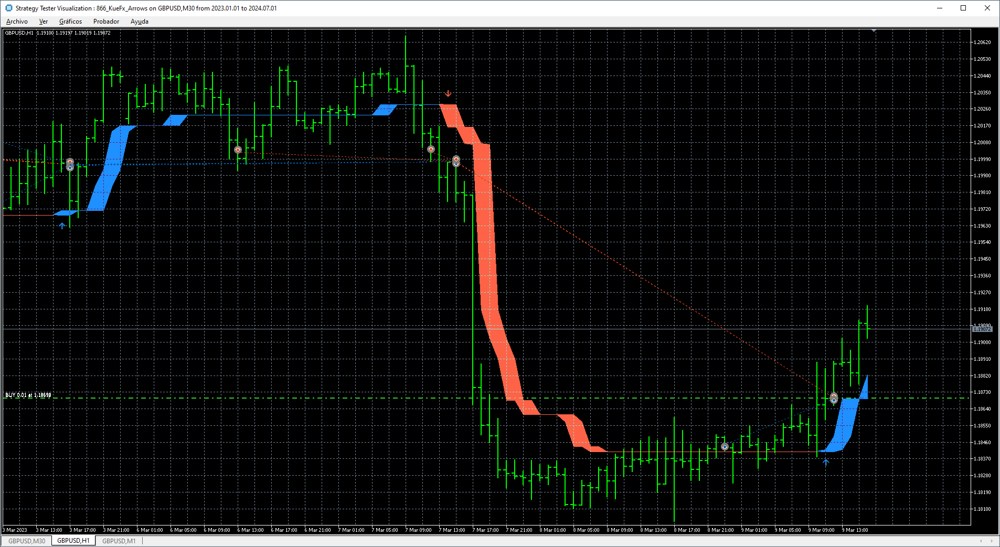
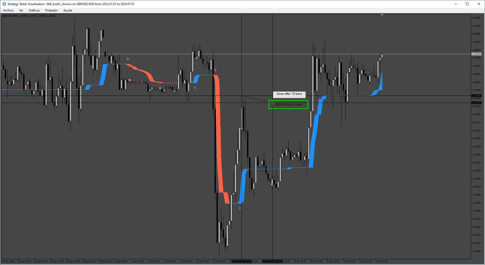

# KueFx_Arrows_EA

> Source: https://fxcodebase.com/code/viewtopic.php?f=38&t=75187  
> Forum: 38 · Topic 75187 · 9 post(s)

---

## KueFx_Arrows_EA

**Apprentice** · Sun Sep 08, 2024 2:21 pm

Based on the request.
[https://fxcodebase.com/code/viewtopic.php?f=17&t=75131](https://fxcodebase.com/code/viewtopic.php?f=17&t=75131)

 [KueFx Arrows.mq5](files/156602/KueFx%20Arrows.mq5)

 [KueFx_Arrows_EA_v1.00.mq5](files/156602/KueFx_Arrows_EA_v1.00.mq5)

---

## Re: KueFx_Arrows_EA

**trigga** · Fri Sep 20, 2024 7:46 am

its only trading buy direction , sell entries are not working as well as close on opposite. love this may you please fix the error

---

## Re: KueFx_Arrows_EA

**trigga** · Fri Sep 20, 2024 8:29 am

this version only opens buy entries in the middle of entries and does not open sell entry on colur change

---

## Re: KueFx_Arrows_EA

**Apprentice** · Mon Sep 23, 2024 2:17 pm

We have added your request to the development list.
Development reference 734

---

## Re: KueFx_Arrows_EA

**Apprentice** · Wed Sep 25, 2024 3:05 pm

[KueFx_Arrows_EA_v1.10.mq5](files/156787/KueFx_Arrows_EA_v1.10.mq5)

Try this version.

---

## Re: KueFx_Arrows_EA

**trigga** · Sun Nov 17, 2024 6:09 am

can you please add the following to the last version of this EA.

1. Take profit by number of candles e.g. if in m15 allow for take profit after e.g. 5 m15 candles
2. 2 timeframe trading eg. When m15 is Buy, i want EA to open buy only entries in m1 after every 1 minute candle close , keep all these entries open and close then when the m15 trend changes to a Sell and Vice Versa

when an H1 signals for a buy appears, I want Ea to start opening buy entries after every 1 minute non stop and close all when the H1 signals changes. I also want it to do the same for the sell side

3. Add setting for Signal timeframe which triggers the lower timeframe and if possible for the lower timeframe too e.g. Main Setting H1, this becomes the signal and lower timeframe opening entries continuously e.g. m5

---

## Re: KueFx_Arrows_EA

**trigga** · Sun Nov 17, 2024 6:10 am

> **Apprentice wrote:**
>
>
> KueFx_Arrows_EA_v1.10.mq5
>
>
> Try this version.

can you please add the following to the last version of this EA.

1. Take profit by number of candles e.g. if in m15 allow for take profit after e.g. 5 m15 candles
2. 2 timeframe trading eg. When m15 is Buy, i want EA to open buy only entries in m1 after every 1 minute candle close , keep all these entries open and close then when the m15 trend changes to a Sell and Vice Versa

when an H1 signals for a buy appears, I want Ea to start opening buy entries after every 1 minute non stop and close all when the H1 signals changes. I also want it to do the same for the sell side

3. Add setting for Signal timeframe which triggers the lower timeframe and if possible for the lower timeframe too e.g. Main Setting H1, this becomes the signal and lower timeframe opening entries continuously e.g. m5

---

## Re: KueFx_Arrows_EA

**Apprentice** · Fri Nov 22, 2024 1:20 pm

We have added your request to the development list.
Development reference 866

---

## Re: KueFx_Arrows_EA

**Apprentice** · Sun Dec 01, 2024 5:40 am

 

 [KueFx_Arrows.mq5](files/157407/KueFx_Arrows.mq5)

 [KueFx_Arrows EA.mq5](files/157407/KueFx_Arrows%20EA.mq5)
