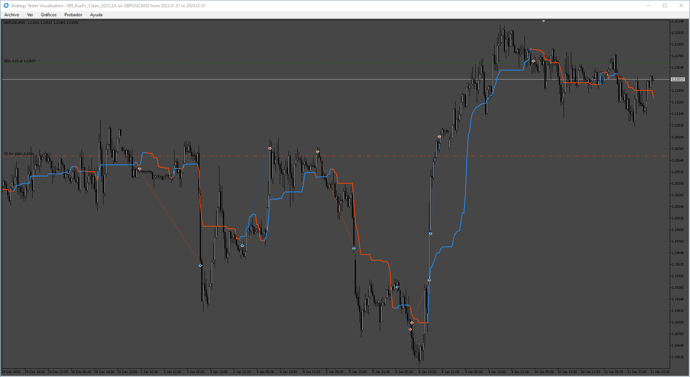
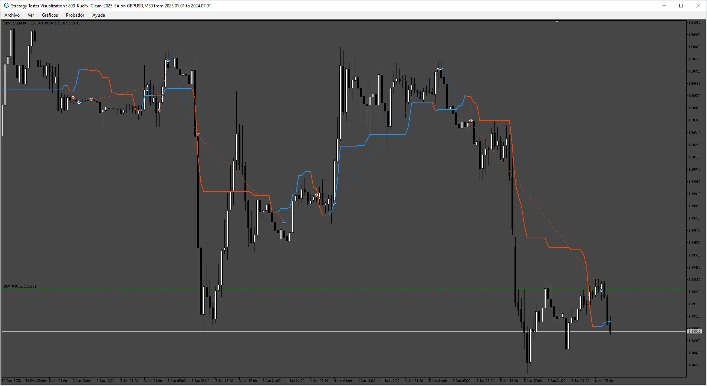
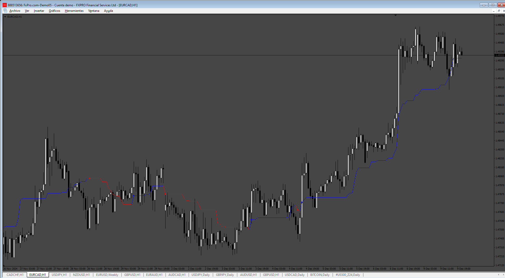

# KueFx_Clean_2025_EA

> Source: https://fxcodebase.com/code/viewtopic.php?f=38&t=75411  
> Forum: 38 · Topic 75411 · 4 post(s)

---

## KueFx_Clean_2025_EA

**Apprentice** · Sat Dec 07, 2024 2:21 pm

 

Based on the request.
[https://fxcodebase.com/code/viewtopic.php?f=17&t=75377](https://fxcodebase.com/code/viewtopic.php?f=17&t=75377)

 [Kijun-sen.mq5](files/157492/Kijun-sen.mq5)

 [KueFx_Clean_2025_EA.mq5](files/157492/KueFx_Clean_2025_EA.mq5)

---

## Re: KueFx_Clean_2025_EA

**trigga** · Sat Dec 07, 2024 5:35 pm

its giving error on installation

saying error install into MQL4/indicators instead of MQL5 . may you please fix it

---

## Re: KueFx_Clean_2025_EA

**Apprentice** · Mon Dec 09, 2024 5:24 am

We have added your request to the development list.
Development reference 906

---

## Re: KueFx_Clean_2025_EA

**Apprentice** · Fri Dec 13, 2024 3:36 pm

 

 [KijunSen.mq4](files/157531/KijunSen.mq4)

 [KijunSen_EA.mq4](files/157531/KijunSen_EA.mq4)
