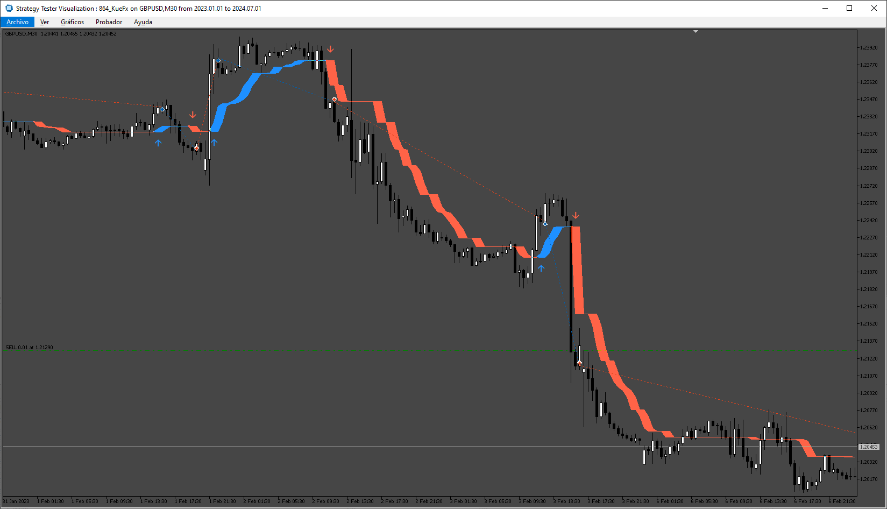

# KueFxTrend EA

> Source: https://fxcodebase.com/code/viewtopic.php?f=38&t=75370  
> Forum: 38 · Topic 75370 · 4 post(s)

---

## KueFxTrend EA

**Apprentice** · Sun Nov 24, 2024 5:22 am

Based on the request.
[https://fxcodebase.com/code/viewtopic.php?f=17&t=75362](https://fxcodebase.com/code/viewtopic.php?f=17&t=75362)

 [KueFx_Trend.mq5](files/157335/KueFx_Trend.mq5)

 [KueFxTrend EA.mq5](files/157335/KueFxTrend%20EA.mq5)

---

## Re: KueFxTrend EA

**trigga** · Sun Nov 24, 2024 11:39 am

its giving error, stating install into mql4 indicators folder but its for mt5. so its not working well and cannot be used

---

## Re: KueFxTrend EA

**Apprentice** · Wed Nov 27, 2024 2:47 pm

We have added your request to the development list.
Development reference 879

---

## Re: KueFxTrend EA

**Apprentice** · Fri Dec 13, 2024 3:58 pm

[KueFxTrend_EA.mq5](files/157539/KueFxTrend_EA.mq5)

Try this version.
