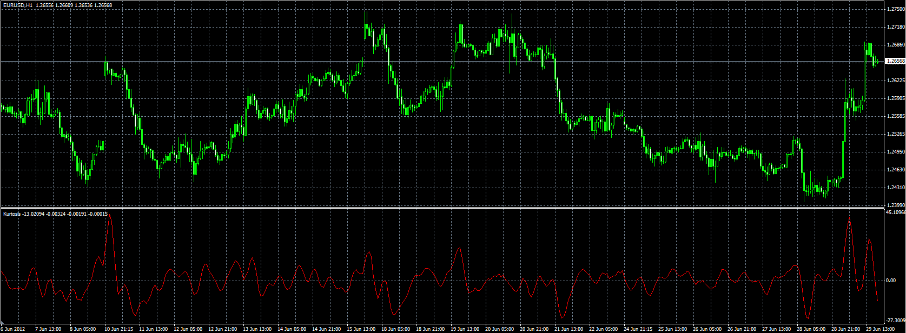

# Kurtosis

> Source: https://fxcodebase.com/code/viewtopic.php?f=38&t=20677  
> Forum: 38 · Topic 20677 · 1 post(s)

---

## Kurtosis

**Alexander.Gettinger** · Fri Jun 29, 2012 1:38 pm

Original indicator: [viewtopic.php?f=17&t=5086](https://fxcodebase.com/code/viewtopic.php?f=17&t=5086)

> The Kurtosis is a market sentiment indicator.
> The formula for the Kurtosis is as follows:
>
> MVA(3) of EMA (66) of ( Momentum[period] - Momentum[period-1] )

 

Download:

 [Kurtosis.mq4](files/36255/Kurtosis.mq4)
