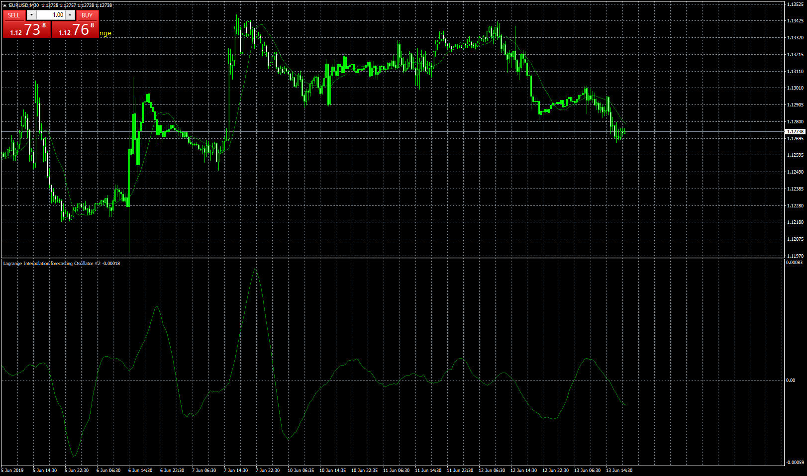

# Lagrange Interpolation forecasting

> Source: https://fxcodebase.com/code/viewtopic.php?f=38&t=68574  
> Forum: 38 · Topic 68574 · 1 post(s)

---

## Lagrange Interpolation forecasting

**Apprentice** · Thu Jun 13, 2019 1:03 pm

Based on TS2/Lua original.
[viewtopic.php?f=17&t=68531](https://fxcodebase.com/code/viewtopic.php?f=17&t=68531)

 [Lagrange Interpolation forecasting.mq4](files/126906/Lagrange%20Interpolation%20forecasting.mq4)

 [Lagrange Interpolation forecasting Oscillator.mq4](files/126906/Lagrange%20Interpolation%20forecasting%20Oscillator.mq4)
