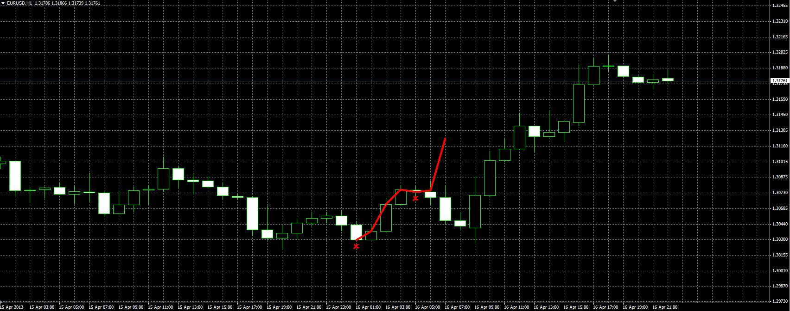
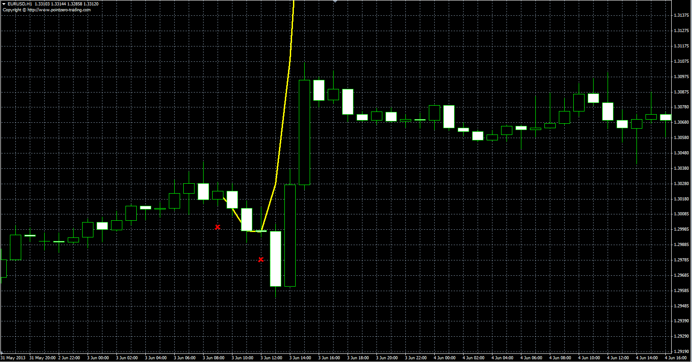

# Lagrange polynomial interpolation

> Source: https://fxcodebase.com/code/viewtopic.php?f=38&t=40836  
> Forum: 38 · Topic 40836 · 1 post(s)

---

## Lagrange polynomial interpolation

**Alexander.Gettinger** · Thu Jun 13, 2013 11:29 am

Lagrange polynomial interpolation between the specified objects on the graph.
Objects can be moved, the indicator is recalculated at the next tick.

 

 

Download:

 [Interpolation.mq4](files/66865/Interpolation.mq4)
