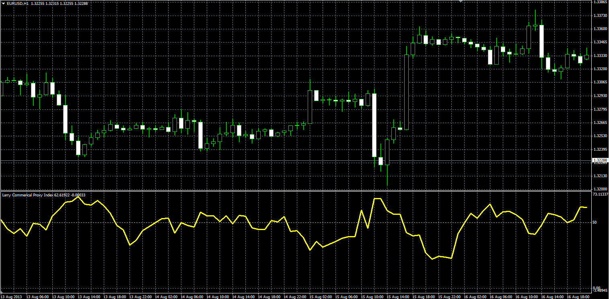
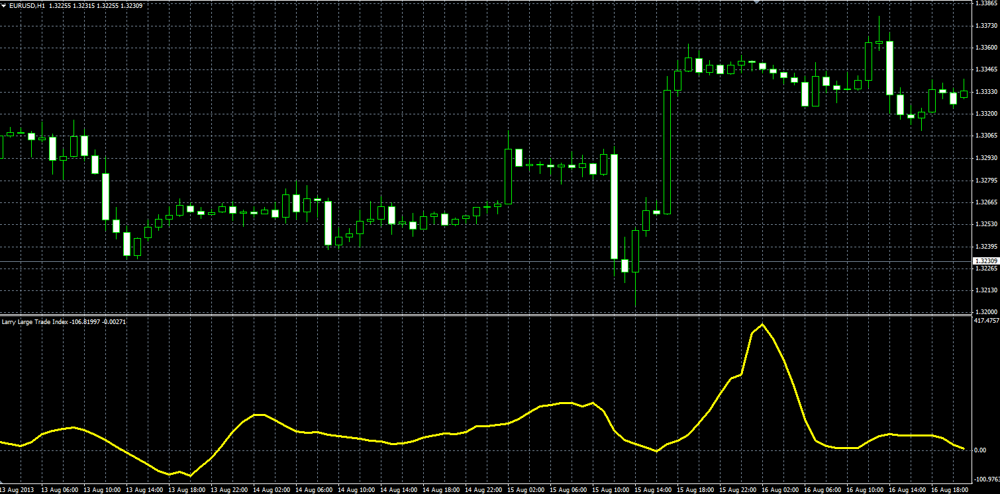
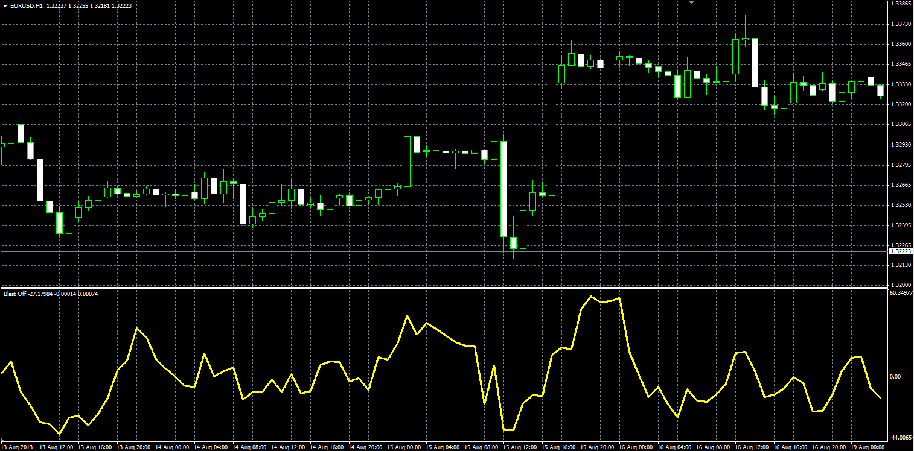
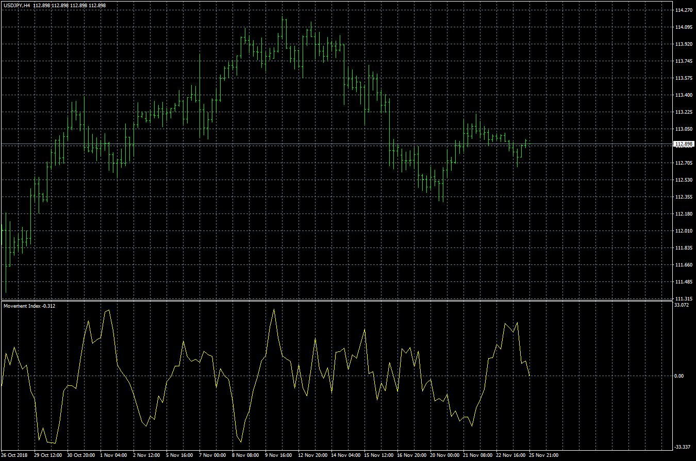
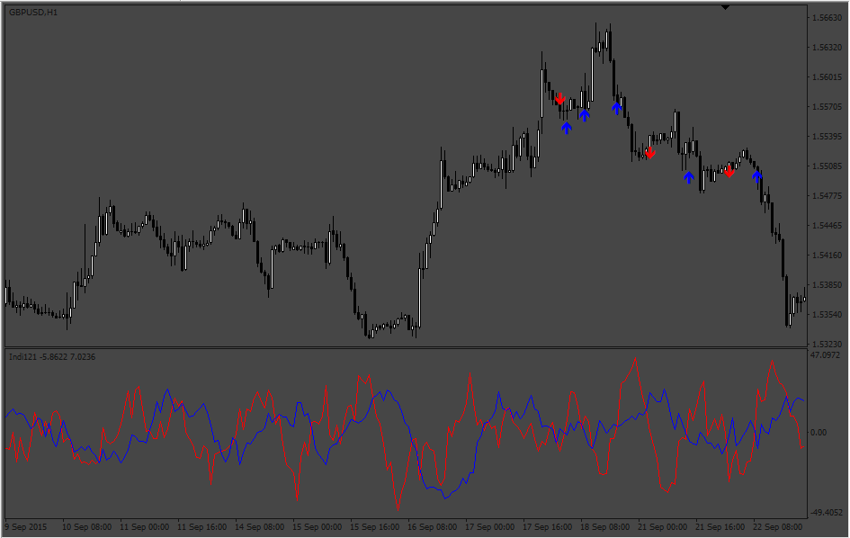

# Larry Commerical Proxy Index

> Source: https://fxcodebase.com/code/viewtopic.php?f=38&t=59355  
> Forum: 38 · Topic 59355 · 20 post(s)

---

## Larry Commerical Proxy Index

**Alexander.Gettinger** · Thu Aug 29, 2013 11:22 am

Original LUA oscillators: [viewtopic.php?f=17&t=54686](https://fxcodebase.com/code/viewtopic.php?f=17&t=54686).

**Larry Commerical Proxy Index:**

 

Download:

 [LWPI.mq4](files/89022/LWPI.mq4)

**Larry Large Trade Index:**

 

Download:

 [LWTI.mq4](files/89022/LWTI.mq4)

**Blast Off:**

 

Download:

 [BO.mq4](files/89022/BO.mq4)

 

 Movement Index= LWPI - LWPI N Period Ago

 [Movement Index.mq4](files/89022/Movement%20Index.mq4)

---

## Re: Larry Commerical Proxy Index

**logicgate** · Sun Jan 20, 2019 2:50 pm

Hello dear friends, hope all is good.

I have a request to mod those indicators.

Can you remove the MAs in the formula and replace them with a VWMA (volume weighted moving average) please? Thanks so much.

---

## Re: Larry Commerical Proxy Index

**Apprentice** · Mon Jan 21, 2019 8:39 am

Your request is added to the development list under Id Number 4434

---

## Re: Larry Commerical Proxy Index

**deepestblue73** · Thu Jan 24, 2019 2:02 pm

Hello,

I have downloaded all three Larry Williams Proxy indicators in MQ4 format, which are excellent.

However, I have a problem with adjusting the "levels" displayed in the indicator pane. If I try and adjust the levels from the "levels"tab, it changes them correctly, but then constantly defaults back to a "50" level only when you navigate away from the chart. This is the case even when you've saved the adjusted levels on the chart as a template. I've even tried adjusting the default "50" level in the code in Metaeditor, but this did not solve the problem.

Can you advise if the indicator should allow me to add/adjust levels on the indicator pane, and if so, what am I doing wrong that's preventing this?

Thanks very much in advance - these indicators are superb!

---

## Re: Larry Commerical Proxy Index

**Apprentice** · Fri Jan 25, 2019 7:05 am

Levels are hardcoded now.
I hope this will help.

---

## Re: Larry Commerical Proxy Index

**Apprentice** · Thu Jan 31, 2019 8:26 am

VWMA only versions.

 [BO.mq4](files/123618/BO.mq4)

 [LWPI.mq4](files/123618/LWPI.mq4)

 [LWTI.mq4](files/123618/LWTI.mq4)

---

## Re: Larry Commerical Proxy Index

**logicgate** · Thu Jan 31, 2019 8:43 pm

> **Apprentice wrote:**
> VWMA only versions.
>
>
> BO.mq4
>
>
>
>
> LWPI.mq4
>
>
>
>
> LWTI.mq4

Thanks brother!!! God Bless.

---

## Re: Larry Commerical Proxy Index

**logicgate** · Thu Feb 14, 2019 2:01 pm

Hello my friend!

You can add one more indicator to this collection: The Commercial Movement Index

Take the output of the LWPI and use in this formula:

Movement Index - Steve Briese introduced this calculation in his book “Commitments of Traders Bible”. It takes the C.O.T. Index output and finds the Rate of Change or (ROC) and outputs that result. When Move Index is selected you will see a second input box call ROC Weeks. This allows you to enter the number of weeks used in the ROC calculation.

Commercial Movement Index = C.O.T. Index[Current] - COT Index[ROC Weeks].

You gonna have to make two versions given that in this thread we have the "normal" one and the one that uses VWMA.

---

## Re: Larry Commerical Proxy Index

**Apprentice** · Sat Feb 16, 2019 3:10 am

About COT.
As you can see no new data was retrieved for 2018.
Until this is fixed by gehtsoft team, will we use Larry Commerical Proxy Index?

---

## Re: Larry Commerical Proxy Index

**logicgate** · Sat Feb 16, 2019 7:27 am

> **Apprentice wrote:**
> About COT.
> As you can see no new data was retrieved for 2018.
> Until this is fixed by gehtsoft team, will we use Larry Commerical Proxy Index?

Becaus of the USA shutdown right? Data is being release with a delay, will return to normal by the 9th of March. You can get good data here:

[http://commitmentsoftraders.org/cot-data/](http://commitmentsoftraders.org/cot-data/)

---

## Re: Larry Commerical Proxy Index

**logicgate** · Sat Feb 16, 2019 7:29 am

But in the case of this indicator here for MT4, we are not gonna use the real COT index data for the Movement Index, use the data from the Larry Commercial Proxy.

---

## Re: Larry Commerical Proxy Index

**Apprentice** · Sun Feb 17, 2019 6:24 am

Will we use VWMA or regular version of Larry Commerical Proxy Index

---

## Re: Larry Commerical Proxy Index

**logicgate** · Sun Feb 17, 2019 9:13 am

> **Apprentice wrote:**
> Will we use VWMA or regular version of Larry Commerical Proxy Index

I think we should use the regular version for the Commercial Movement Index.

---

## Re: Larry Commerical Proxy Index

**Apprentice** · Mon Feb 18, 2019 7:01 am

Movement Index.mq4 added.

---

## Re: Larry Commerical Proxy Index

**evansrono** · Wed Feb 23, 2022 7:01 am

Hi,

Could you create an alert based (touch &/cross closed candle options) MT4 indicator based on two Movement Index indicators crossing each other.

Thanks

---

## Re: Larry Commerical Proxy Index

**Apprentice** · Thu Feb 24, 2022 8:35 am

Your request is added to the development list.
Development reference 121.

---

## Re: Larry Commerical Proxy Index

**evansrono** · Tue Mar 08, 2022 5:59 am

Hi,

Please include multiple time frame feature. Thanks.

---

## Re: Larry Commerical Proxy Index

**Apprentice** · Tue Mar 29, 2022 7:50 am

 [Movement Index indicators Alert.mq4](files/145470/Movement%20Index%20indicators%20Alert.mq4)

---

## Re: Larry Commerical Proxy Index

**logicgate** · Mon May 22, 2023 4:32 pm

Hello dear friend Apprentice, can you add an option to invert the data plotted on the Larry Commercial Proxy Index? Seems better to read this way.

---

## Re: Larry Commerical Proxy Index

**Apprentice** · Wed May 24, 2023 8:34 am

We have added your request to the development list.
Development reference 466.
