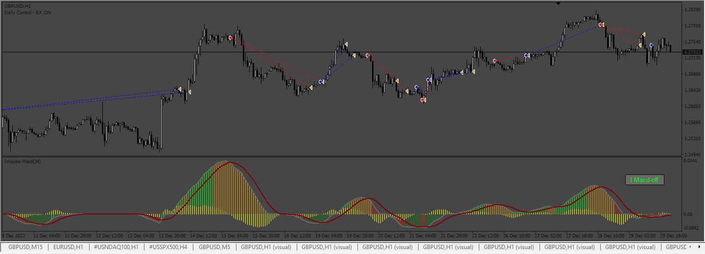
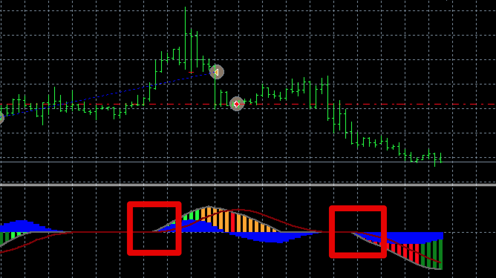
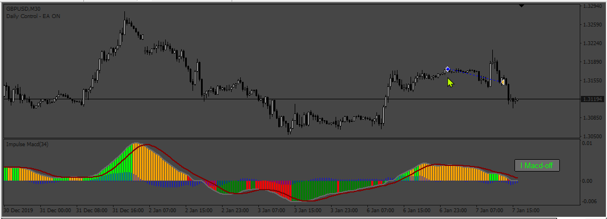
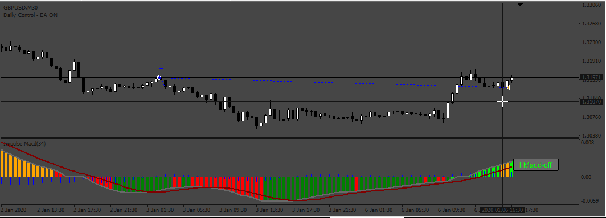
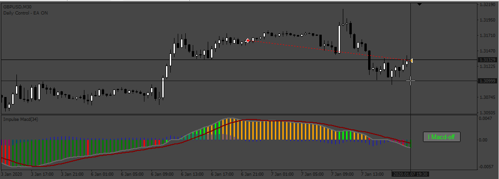
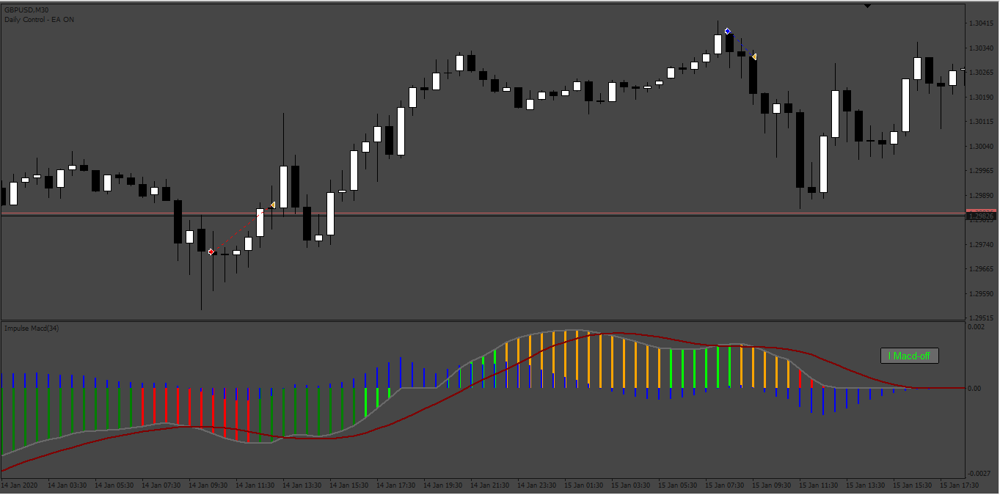

# Lazybear_Impulse_MACD_EA

> Source: https://fxcodebase.com/code/viewtopic.php?f=38&t=74827  
> Forum: 38 · Topic 74827 · 4 post(s)

---

## Lazybear_Impulse_MACD_EA

**Apprentice** · Mon Apr 29, 2024 11:26 am

Based on the request.
[https://fxcodebase.com/code/viewtopic.p ... 26#p155026](https://fxcodebase.com/code/viewtopic.php?f=27&p=155026#p155026)

 [! Impulse Macd (alerts + btn).ex4](files/155197/Impulse%20Macd%20%28alerts%20btn%29.ex4)

 [Lazybear_Impulse_MACD_EA.mq4](files/155197/Lazybear_Impulse_MACD_EA.mq4)

---

## Re: Lazybear_Impulse_MACD_EA

**trtrader** · Wed May 15, 2024 3:31 pm

Hi,

Could you please add 2 options?

1. If true, close buy positions after the first orange bar is closed. and close the sell position after the first green bar closed below zero.

2. Histogram filter. If true, only open buy orders if gray/or red lines are above zero. and only sell orders if below zero.

In cases when no impulse, red and gray lines on zero line just open whatever the blue histogram shows.

 

---

## Re: Lazybear_Impulse_MACD_EA

**Apprentice** · Fri May 17, 2024 4:20 pm

We have added your request to the development list.
Development reference 388

---

## Re: Lazybear_Impulse_MACD_EA

**Apprentice** · Thu May 23, 2024 2:07 pm

 

 

 

 [Lazybear_Impulse_MACD_EA_v2.0.mq4](files/155477/Lazybear_Impulse_MACD_EA_v2.0.mq4)
