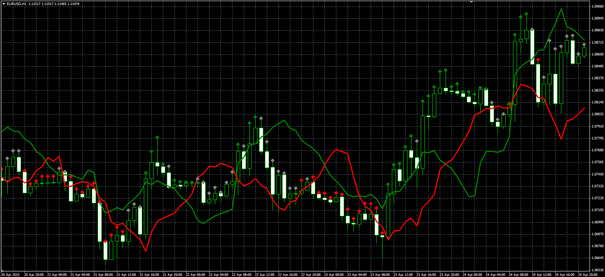

# LBR Paint Bars

> Source: https://fxcodebase.com/code/viewtopic.php?f=38&t=62198  
> Forum: 38 · Topic 62198 · 1 post(s)

---

## LBR Paint Bars

**Alexander.Gettinger** · Fri May 08, 2015 10:10 am

Original LUA indicator: [viewtopic.php?f=17&t=62123](https://fxcodebase.com/code/viewtopic.php?f=17&t=62123).

> LBR Paint Bars changes the color of the price bars depending on the trend direction. The trend is determined by the position of 2 volatility lines.
> Line1 = Min of Last N + ATR;
> Line2= Max of Last N - ATR;

 

Download:

 [LBR_Paint_Bars.mq4](files/100358/LBR_Paint_Bars.mq4)
