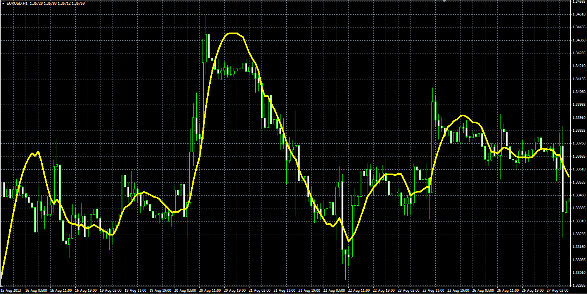

# Least Square Moving Average

> Source: https://fxcodebase.com/code/viewtopic.php?f=38&t=59628  
> Forum: 38 · Topic 59628 · 1 post(s)

---

## Least Square Moving Average

**Alexander.Gettinger** · Wed Oct 09, 2013 10:01 am

Formulas:
LSMA[i]=Sum/L2, where
Sum[i] = (Length-N)*Price[i]+(Length-N-1)*Price[i-1]+…+(1-N)*Price[i-Length+1],
N = (Length+1)/3,
L2 = Length*(Length+1)/6.

 

Download:

 [LSMA.mq4](files/89910/LSMA.mq4)
