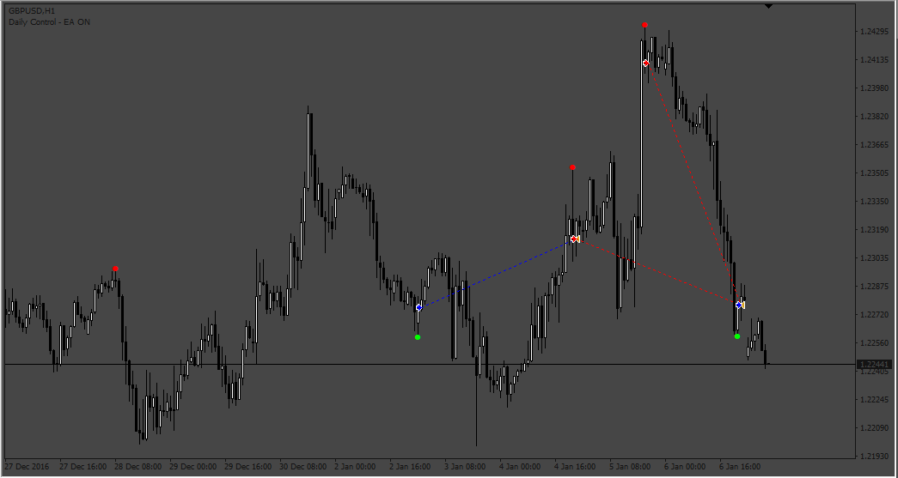
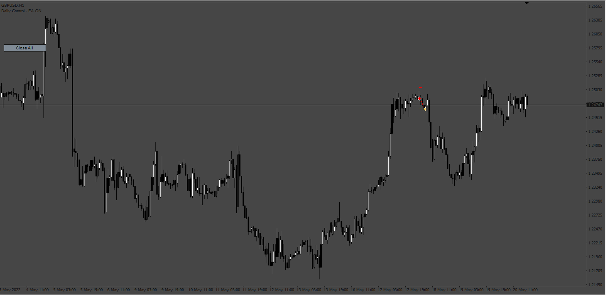

# Leledc_Exhaustion_EA

> Source: https://fxcodebase.com/code/viewtopic.php?f=38&t=73312  
> Forum: 38 · Topic 73312 · 4 post(s)

---

## Leledc_Exhaustion_EA

**Apprentice** · Wed Feb 01, 2023 11:13 am

Based on the request.
[https://fxcodebase.com/code/viewtopic.php?f=27&p=149349](https://fxcodebase.com/code/viewtopic.php?f=27&p=149349)

 [Leledc-ExhaustionBar1.mq4](files/149429/Leledc-ExhaustionBar1.mq4)

 [Leledc_Exhaustion_EA.mq4](files/149429/Leledc_Exhaustion_EA.mq4)

---

## Re: Leledc_Exhaustion_EA

**divinenoize** · Wed Aug 09, 2023 3:35 pm

Good day, can you add multi timeframe option where your highest timeframe you choose is the master and the lower timeframe only alerts you if the candle closes in the same direction? Also, can it be mobile alerts?

---

## Re: Leledc_Exhaustion_EA

**Apprentice** · Wed Aug 16, 2023 3:15 pm

We have added your request to the development list.
Development reference 738.

---

## Re: Leledc_Exhaustion_EA

**Apprentice** · Mon Sep 11, 2023 6:25 am

 [Leledc_Exhaustion_EA_v2.mq4](files/152513/Leledc_Exhaustion_EA_v2.mq4)
