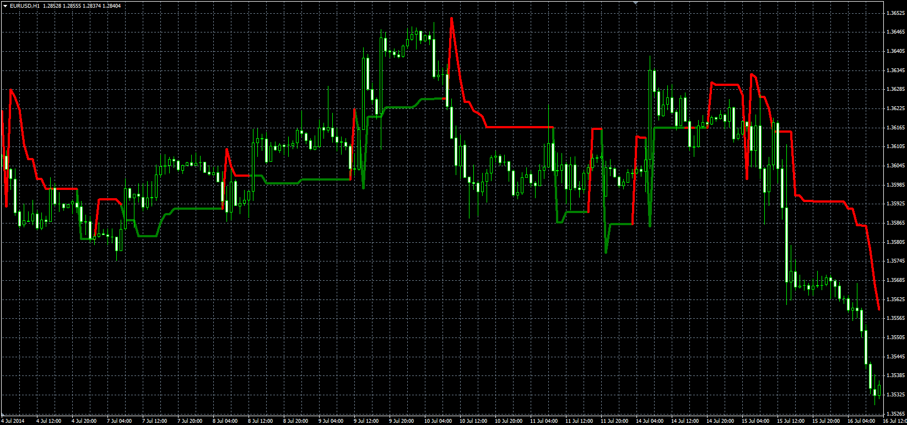

# LeMan Stop

> Source: https://fxcodebase.com/code/viewtopic.php?f=38&t=61219  
> Forum: 38 · Topic 61219 · 1 post(s)

---

## LeMan Stop

**Alexander.Gettinger** · Mon Sep 22, 2014 11:05 am

Original LUA indicator: [viewtopic.php?f=17&t=27929](https://fxcodebase.com/code/viewtopic.php?f=17&t=27929).

Formulas:
LeMan Stop[i] = Open[i-1]-Coeff*MVA(HO, Length), if dMA>0,
LeMan Stop[i] = Open[i-1]+Coeff*MVA(OL, Length), if dMA<0, where
HO = High-Open,
OL = Open-Low,
dMA = FastMA-SlowMA,
FastMA - MA(Close) with [Fast_MA_Length] number of periods and [Fast_MA_Method] type,
SlowMA - MA(Close) with [Slow_MA_Length] number of periods and [Slow_MA_Method] type.

 

Download:

 [LeManStop.mq4](files/96087/LeManStop.mq4)
