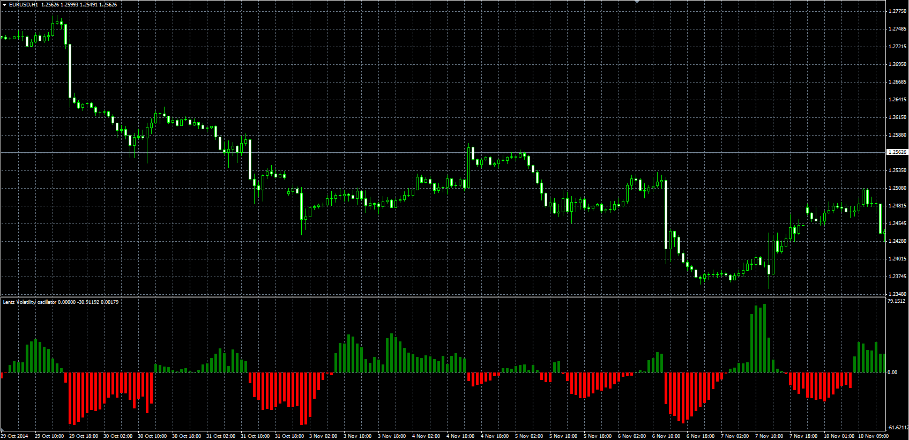

# Lentz Volatility

> Source: https://fxcodebase.com/code/viewtopic.php?f=38&t=61495  
> Forum: 38 · Topic 61495 · 1 post(s)

---

## Lentz Volatility

**Alexander.Gettinger** · Thu Nov 20, 2014 10:20 am

Original LUA oscillator: [viewtopic.php?f=17&t=10521](https://fxcodebase.com/code/viewtopic.php?f=17&t=10521).

Formula:
LV = Avg_MA - ATR, where
Avg_MA = MA(ATR) with [MA_Length] number of periods and [MA_Method] type,
ATR - average true range with [ATR_Length] number of periods.

 

Download:

 [Lentz_Volatility.mq4](files/97225/Lentz_Volatility.mq4)
