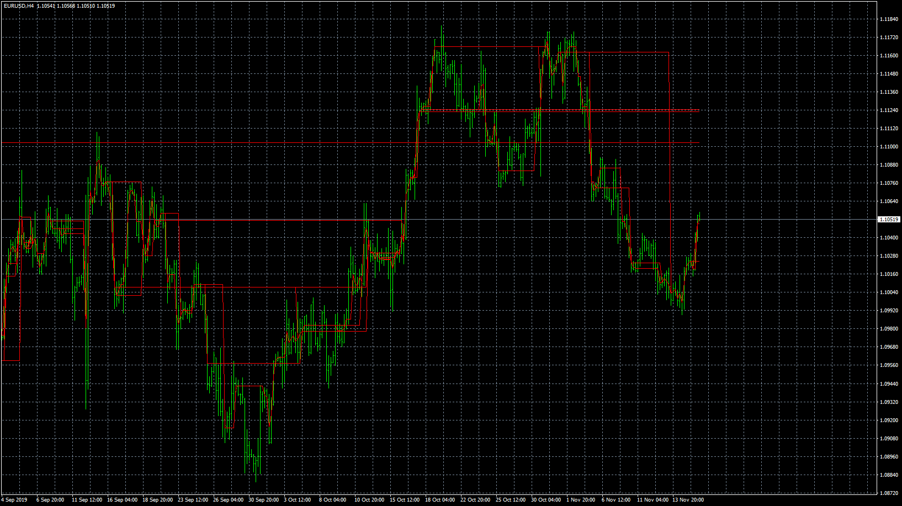

# Levels_Ft._Volume

> Source: https://fxcodebase.com/code/viewtopic.php?f=38&t=69172  
> Forum: 38 · Topic 69172 · 12 post(s)

---

## Levels_Ft._Volume

**Apprentice** · Fri Nov 29, 2019 6:18 am

Based on request.
[viewtopic.php?f=38&p=129972](https://fxcodebase.com/code/viewtopic.php?f=38&p=129972)

 [Levels_Ft._Volume.mq4](files/130004/Levels_Ft._Volume.mq4)

---

## Re: Levels_Ft._Volume

**aladdin007** · Fri Nov 29, 2019 7:24 pm

Thank you so much mr Mario apprentice

---

## Re: Levels_Ft._Volume

**SmartyPants1216** · Thu Aug 13, 2020 11:16 am

Thank you so much Apprentice. Is it possible to post more samples of Levels_Ft._Volume? Your site is great, I look forward to learning more.

---

## Re: Levels_Ft._Volume

**SmartyPants1216** · Thu Aug 13, 2020 1:23 pm

By the way, can you update the indicator and add symbols? And have the option to change the color of the lines. Thank you so much.

---

## Re: Levels_Ft._Volume

**Apprentice** · Fri Aug 14, 2020 5:34 am

As dasboard or only to be able to show other instrument levels?

---

## Re: Levels_Ft._Volume

**SmartyPants1216** · Fri Aug 14, 2020 8:18 am

Apprentice thank you so much for your answer. After testing the indicator, is it possible to add other symbols and have the option to change the color of the lines? Again, thank you so much.

---

## Re: Levels_Ft._Volume

**SmartyPants1216** · Wed Sep 16, 2020 5:11 am

Is it possible to add symbols at the same indicator? Thank you so much.

---

## Re: Levels_Ft._Volume

**Apprentice** · Wed Sep 16, 2020 11:02 am

> Is it possible to add symbols at the same indicator? Thank you so much.

Can you clarify?
Is it Dashboard or something else?

---

## Re: Levels_Ft._Volume

**SmartyPants1216** · Wed Sep 16, 2020 4:15 pm

Please see attached

---

## Re: Levels_Ft._Volume

**Apprentice** · Thu Sep 17, 2020 2:17 am

My question. How to display, different instruments on the same chart?
For example Yen pairs or EUR / USD chart?

---

## Re: Levels_Ft._Volume

**SmartyPants1216** · Thu Sep 17, 2020 7:35 pm

Yes ,different instruments on the same chart, thank you!

---

## Re: Levels_Ft._Volume

**Apprentice** · Fri Sep 18, 2020 2:57 am

Not, sure how we will present 100 of USD/JPY on EUR/USD...
Can you provide some solution for this?
