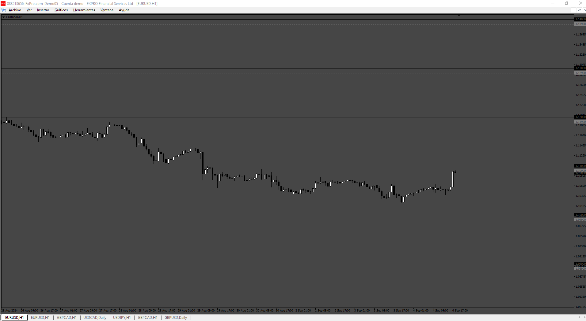

# Levels

> Source: https://fxcodebase.com/code/viewtopic.php?f=38&t=75203  
> Forum: 38 · Topic 75203 · 4 post(s)

---

## Levels

**Apprentice** · Tue Sep 10, 2024 12:20 pm

Based on the request.
[https://fxcodebase.com/code/viewtopic.p ... 39#p156539](https://fxcodebase.com/code/viewtopic.php?f=27&p=156539#p156539)

 [Levels.mq4](files/156656/Levels.mq4)

---

## Re: Levels

**mjf1288** · Wed Sep 11, 2024 7:42 am

> **Apprentice wrote:**
>
>
> 686.png
>
>
> Based on the request.
> [https://fxcodebase.com/code/viewtopic.p ... 39#p156539](https://fxcodebase.com/code/viewtopic.php?f=27&p=156539#p156539)
>
>
> Levels.mq4

can this be converted to .LUA? thanks

---

## Re: Levels

**Apprentice** · Sat Sep 14, 2024 3:42 am

We have added your request to the development list.
Development reference 712

---

## Re: Levels

**Apprentice** · Sun Dec 01, 2024 3:59 am

Try this version.
[https://fxcodebase.com/code/viewtopic.p ... 81#p157381](https://fxcodebase.com/code/viewtopic.php?f=17&t=75380&p=157381#p157381)
