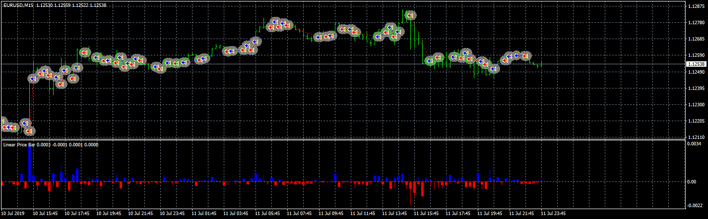
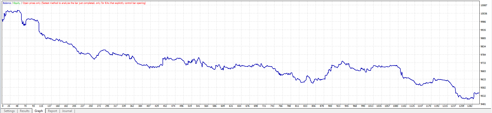
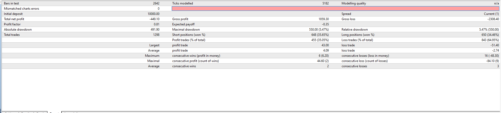

# Linear Price Bar EA

> Source: https://fxcodebase.com/code/viewtopic.php?f=38&t=68736  
> Forum: 38 · Topic 68736 · 3 post(s)

---

## Linear Price Bar EA

**Apprentice** · Fri Aug 02, 2019 3:37 am

 

 

[viewtopic.php?f=27&t=68727](https://fxcodebase.com/code/viewtopic.php?f=27&t=68727)

 [Linear Price Bar.mq4](files/127691/Linear%20Price%20Bar.mq4)

 [Linear Price Bar EA.mq4](files/127691/Linear%20Price%20Bar%20EA.mq4)

---

## Re: Linear Price Bar EA

**Sp2562** · Wed Aug 07, 2019 8:19 pm

A candle greater than 0.001 should open only one purchase order and close on the same candle.
The same should happen for the sell signal.

The EA should not open order on one candle and close on 2 or 3 later candles.

---

## Re: Linear Price Bar EA

**Apprentice** · Mon Aug 12, 2019 6:27 am

[Linear Price Bar EA.mq4](files/127848/Linear%20Price%20Bar%20EA.mq4)

Try this version.
