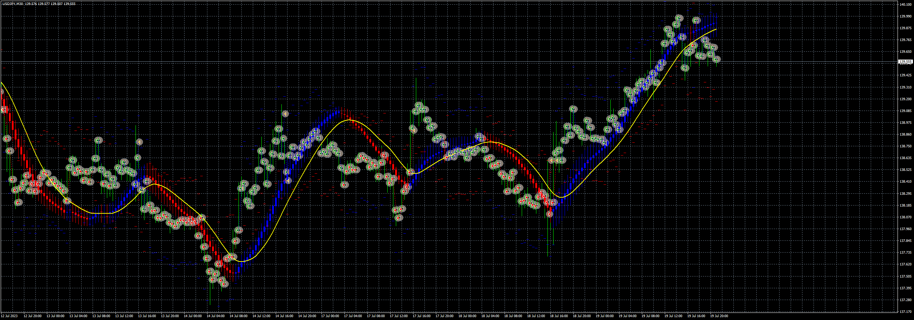
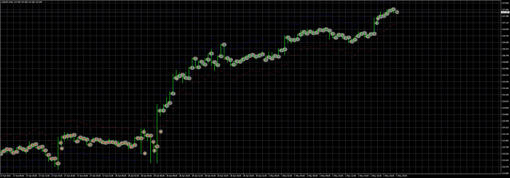

# Linear_Regression_Bar_EA

> Source: https://fxcodebase.com/code/viewtopic.php?f=38&t=73951  
> Forum: 38 · Topic 73951 · 2 post(s)

---

## Linear_Regression_Bar_EA

**Apprentice** · Wed Jul 19, 2023 1:16 pm

Based on the request.
[https://fxcodebase.com/code/viewtopic.php?f=17&t=73866](https://fxcodebase.com/code/viewtopic.php?f=17&t=73866)
Linear_Regression_Bar
[https://fxcodebase.com/code/viewtopic.php?f=38&t=73884](https://fxcodebase.com/code/viewtopic.php?f=38&t=73884)

 [Linear_Regression_Bar_EA_v1.00.mq4](files/151689/Linear_Regression_Bar_EA_v1.00.mq4)

---

## SuperTrend_EA_v1.00

**Apprentice** · Wed Jul 19, 2023 1:17 pm

Based on the request.
[https://fxcodebase.com/code/viewtopic.php?f=17&t=73866](https://fxcodebase.com/code/viewtopic.php?f=17&t=73866)
SuperTrend Indicator
[https://fxcodebase.com/code/viewtopic.php?f=38&t=73876](https://fxcodebase.com/code/viewtopic.php?f=38&t=73876)

 [SuperTrend_EA_v1.00.mq4](files/151690/SuperTrend_EA_v1.00.mq4)
