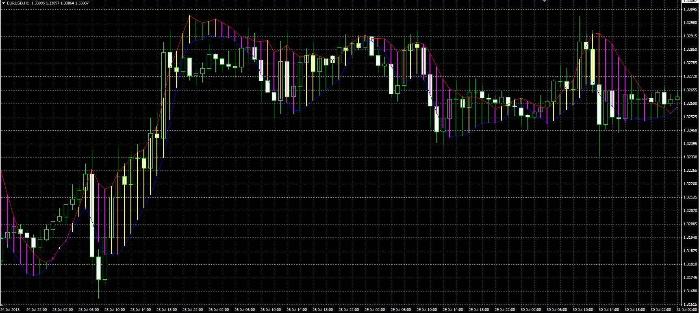

# Linear Regression High/Low band

> Source: https://fxcodebase.com/code/viewtopic.php?f=38&t=59059  
> Forum: 38 · Topic 59059 · 1 post(s)

---

## Linear Regression High/Low band

**Alexander.Gettinger** · Tue Aug 13, 2013 8:56 am

The oscillator uses for its calculations indicator Linear Regression Line ([viewtopic.php?f=38&t=59052](https://fxcodebase.com/code/viewtopic.php?f=38&t=59052)).

Formulas:
Hbuff = Linear Regression Line (High, Period),
Lbuff = Linear Regression Line (Low, Period).

 

Download:

 [HL_LR_Band.mq4](files/88476/HL_LR_Band.mq4)

For this indicator must be installed Linear Regression Line indicator ([viewtopic.php?f=38&t=59052](https://fxcodebase.com/code/viewtopic.php?f=38&t=59052)).
