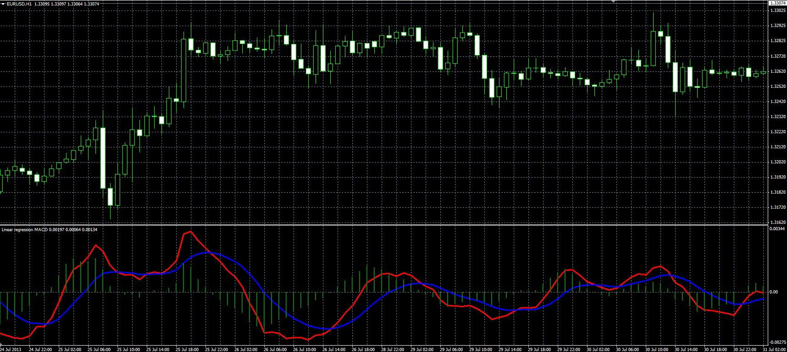

# Linear Regression MACD

> Source: https://fxcodebase.com/code/viewtopic.php?f=38&t=59056  
> Forum: 38 · Topic 59056 · 1 post(s)

---

## Linear Regression MACD

**Alexander.Gettinger** · Tue Aug 13, 2013 8:50 am

Original LUA indicator: [viewtopic.php?f=17&t=59055&p=88471#p88471](http://www.fxcodebase.com/code/viewtopic.php?f=17&t=59055&p=88471#p88471).

 

Download:

 [LR_MACD.mq4](files/88472/LR_MACD.mq4)

 [LR_MACD2.mq4](files/88472/LR_MACD2.mq4)

For this indicator must be installed Linear Regression Line indicator ([http://fxcodebase.com/code/viewtopic.php?f=38&t=59052](https://fxcodebase.com/code/viewtopic.php?f=38&t=59052)).
