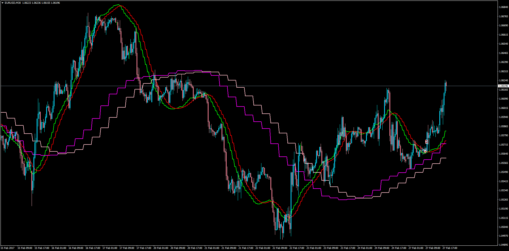

# Linear Regression Multi Time Frame

> Source: https://fxcodebase.com/code/viewtopic.php?f=38&t=64491  
> Forum: 38 · Topic 64491 · 1 post(s)

---

## Linear Regression Multi Time Frame

**Apprentice** · Mon Feb 27, 2017 4:39 pm

LUA Original: [viewtopic.php?f=17&t=3479](https://fxcodebase.com/code/viewtopic.php?f=17&t=3479)

Description:
In this MT4 version of the LUA original, the trade has the option to work with the current TF or choose a bigger one. The trader can then work with multiple dimensions (instances) in the same chart.

The LR formula is calculated like this:

LR = 3 * LWMA - 2 * SMA
Signal = SMA(5) of the LR

 [MTF_LRMA.mq4](files/111231/MTF_LRMA.mq4)
