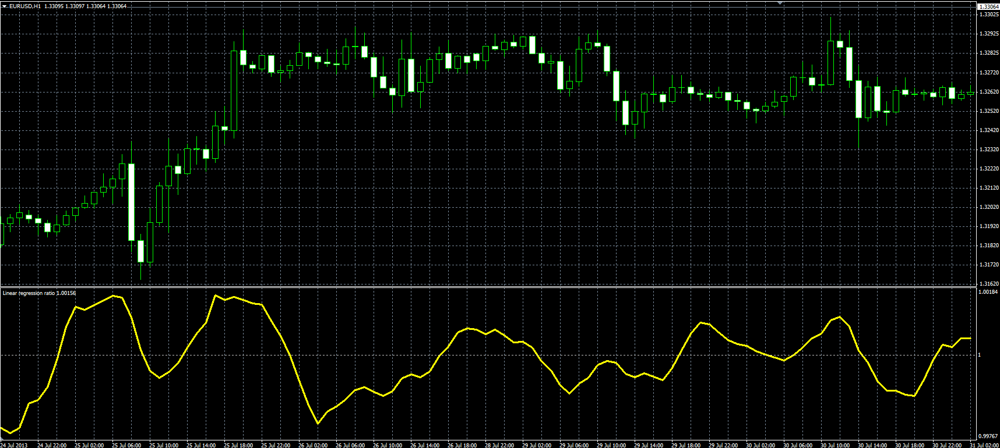

# Linear regression ratio oscillator

> Source: https://fxcodebase.com/code/viewtopic.php?f=38&t=59054  
> Forum: 38 · Topic 59054 · 1 post(s)

---

## Linear regression ratio oscillator

**Alexander.Gettinger** · Tue Aug 13, 2013 8:39 am

Original LUA oscillator: [http://fxcodebase.com/code/viewtopic.php?f=17&t=59051](https://fxcodebase.com/code/viewtopic.php?f=17&t=59051).

 

Download:

 [LR_Ratio.mq4](files/88469/LR_Ratio.mq4)

For this oscillator must be installed Linear Regression Line indicator ([viewtopic.php?f=38&t=59052&p=88466#p88466](http://www.fxcodebase.com/code/viewtopic.php?f=38&t=59052&p=88466#p88466)).
