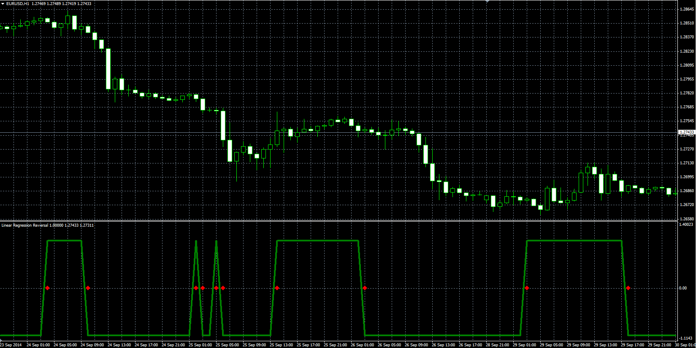

# Linear Regression Reversal Indicator

> Source: https://fxcodebase.com/code/viewtopic.php?f=38&t=61458  
> Forum: 38 · Topic 61458 · 1 post(s)

---

## Linear Regression Reversal Indicator

**Alexander.Gettinger** · Mon Nov 17, 2014 5:29 pm

Original LUA oscillator: [viewtopic.php?f=17&t=22433](https://fxcodebase.com/code/viewtopic.php?f=17&t=22433).

> This indicator is based on LWMA (Linear Regression) moving average.
> If LWMA increases the value of the indicator is 1
> If LWMA decreases the value of the indicator is -1

 

Download:

 [Linear_Regression_Reversal.mq4](files/97134/Linear_Regression_Reversal.mq4)
