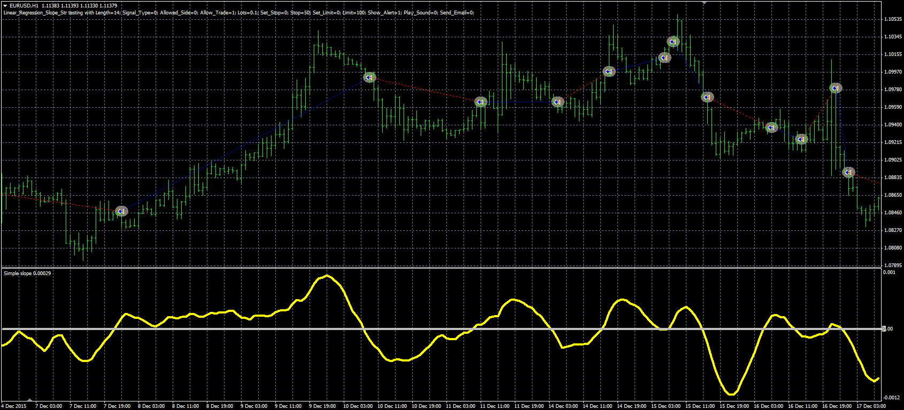
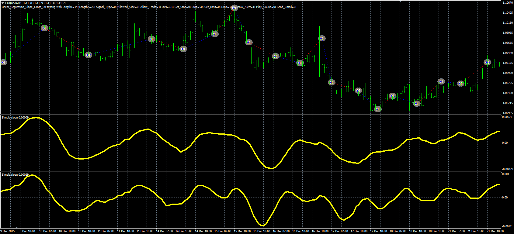

# Linear regression slope strategies

> Source: https://fxcodebase.com/code/viewtopic.php?f=38&t=63589  
> Forum: 38 · Topic 63589 · 1 post(s)

---

## Linear regression slope strategies

**Alexander.Gettinger** · Thu Jun 09, 2016 5:22 pm

The strategy based on the Linear regression slope oscillator ([viewtopic.php?f=38&t=63575](https://fxcodebase.com/code/viewtopic.php?f=38&t=63575)).

**Strategy 1**

Buy condition: LRS crosses above the zero line.
Sell condition: LRS crosses under the zero line.

 

Download:

 [Linear_Regression_Slope_Str.mq4](files/106707/Linear_Regression_Slope_Str.mq4)

**Strategy 2**

Buy condition: LRS1 crosses above LRS2.
Sell condition: LRS1 crosses under LRS2.

 

Download:

 [Linear_Regression_Slope_Cross_Str.mq4](files/106707/Linear_Regression_Slope_Cross_Str.mq4)

The Linear regression slope oscillator ([viewtopic.php?f=38&t=63575](https://fxcodebase.com/code/viewtopic.php?f=38&t=63575)) should be installed for correct work.
