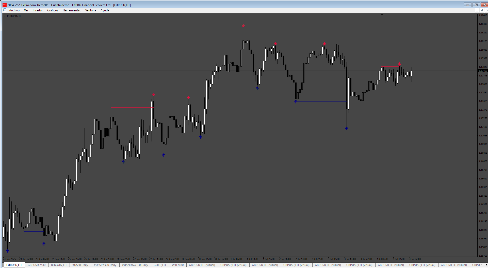
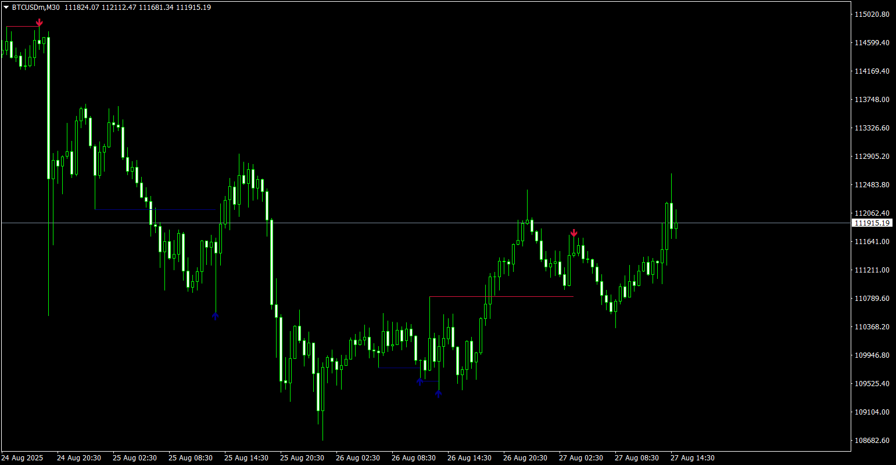
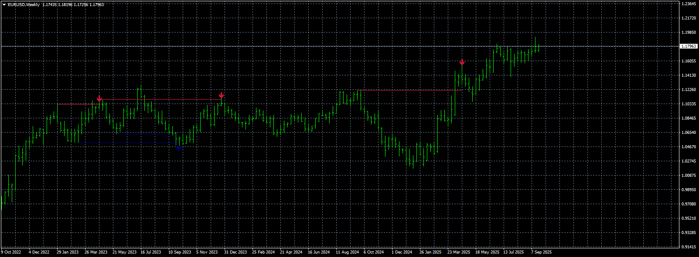

# LiquiditySweep

> Source: https://fxcodebase.com/code/viewtopic.php?f=38&t=76125  
> Forum: 38 · Topic 76125 · 7 post(s)

---

## LiquiditySweep

**Apprentice** · Mon Jul 07, 2025 4:16 pm

Based on the request.
[https://fxcodebase.com/code/viewtopic.p ... 25#p159725](https://fxcodebase.com/code/viewtopic.php?f=27&t=76066&p=159725#p159725)

 [LiquiditySweep.mq4](files/159853/LiquiditySweep.mq4)

---

## Re: LiquiditySweep

**Luci Lira** · Mon Aug 11, 2025 5:12 pm

> **Apprentice wrote:**
>
>
> 414.png
>
>
> Based on the request.
> [https://fxcodebase.com/code/viewtopic.p ... 25#p159725](https://fxcodebase.com/code/viewtopic.php?f=27&t=76066&p=159725#p159725)
>
>
> LiquiditySweep.mq4

pls, make to MQ5 to

---

## Re: LiquiditySweep

**Apprentice** · Mon Aug 18, 2025 7:25 am

We have added your request to the development list.
Development reference 528

---

## Re: LiquiditySweep

**Apprentice** · Fri Aug 29, 2025 4:59 am

 [LiquiditySweep.mq5](files/160414/LiquiditySweep.mq5)

---

## Re: LiquiditySweep

**sillymelon** · Fri Aug 29, 2025 9:05 am

Would it be possible to have the MT4 version with alerts please?

Thank you.

---

## Re: LiquiditySweep

**Apprentice** · Sun Aug 31, 2025 3:30 am

We have added your request to the development list.
Development reference 550

---

## Re: LiquiditySweep

**Apprentice** · Tue Sep 23, 2025 3:30 am

 [LiquiditySweep.mq4](files/160597/LiquiditySweep.mq4)
