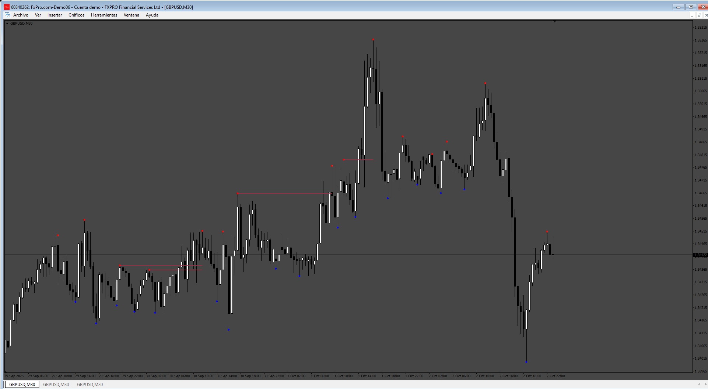
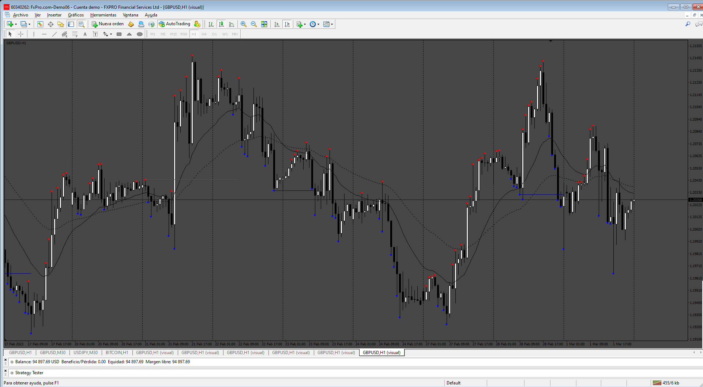

# LiquiditySweepFilter

> Source: https://fxcodebase.com/code/viewtopic.php?f=38&t=76351  
> Forum: 38 · Topic 76351 · 6 post(s)

---

## LiquiditySweepFilter

**Apprentice** · Sat Oct 04, 2025 2:12 pm

Based on the request.
[https://fxcodebase.com/code/viewtopic.php?f=38&t=76259](https://fxcodebase.com/code/viewtopic.php?f=38&t=76259)

 [LiquiditySweepFilter.mq4](files/160759/LiquiditySweepFilter.mq4)

---

## Re: LiquiditySweepFilter

**khanatd** · Tue Oct 14, 2025 12:26 am

hi sir make it 100% nrp at close of current candle arrow, thanks
khan

---

## Re: LiquiditySweepFilter

**khanatd** · Wed Oct 15, 2025 1:53 am

hi sir arrows or dots should appear at close of current candle non repaint, but it is repainging\ heavily

thanks
khan

---

## Re: LiquiditySweepFilter

**Apprentice** · Sat Oct 18, 2025 1:13 pm

We have added your request to the development list.
Development reference 666

---

## Re: LiquiditySweepFilter

**khanatd** · Tue Oct 21, 2025 9:36 pm

hi sir plz add mt4 non repaint arrows at close of current candle or reversals/continuations /breakouts etc
kindly
thanks
khan

---

## Re: LiquiditySweepFilter

**Apprentice** · Sat Oct 25, 2025 11:46 am

 [LiquiditySweepFilter_NRP.mq4](files/161049/LiquiditySweepFilter_NRP.mq4)
