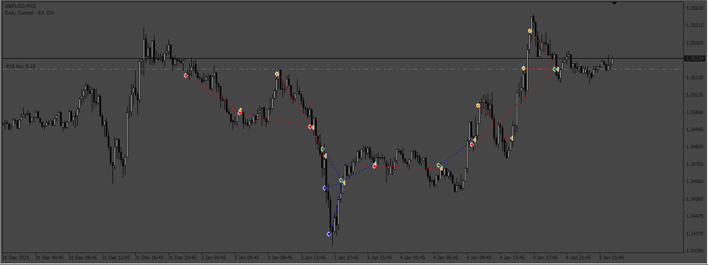
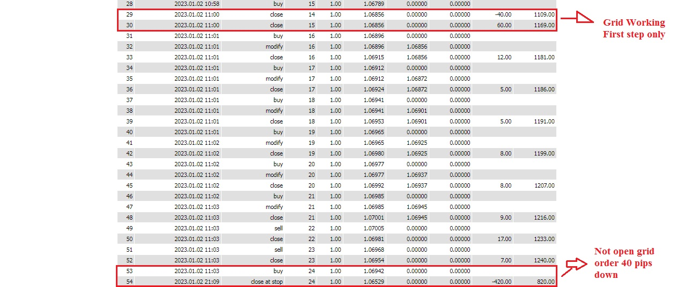

# Littlechang

> Source: https://fxcodebase.com/code/viewtopic.php?f=38&t=74242  
> Forum: 38 · Topic 74242 · 5 post(s)

---

## Littlechang

**Apprentice** · Fri Oct 13, 2023 2:51 am

Based on the request.
[https://fxcodebase.com/code/viewtopic.php?f=38&t=74220](https://fxcodebase.com/code/viewtopic.php?f=38&t=74220)

 [Littlechang.mq4](files/152906/Littlechang.mq4)

---

## Re: Littlechang

**jiangchang** · Fri Oct 13, 2023 11:37 pm

> **Apprentice wrote:**
>
>
> 903.png
>
>
> Based on the request.
> [https://fxcodebase.com/code/viewtopic.php?f=38&t=74220](https://fxcodebase.com/code/viewtopic.php?f=38&t=74220)
>
>
> Littlechang.mq4

Grate Job will move to test will share something

Thank you Very Much

---

## Re: Littlechang

**jiangchang** · Tue Oct 17, 2023 1:51 am

 

> **Apprentice wrote:**
>
>
> The attachment **Grid Not Working.jpg** is no longer available
>
>
> Based on the request.
> [https://fxcodebase.com/code/viewtopic.php?f=38&t=74220](https://fxcodebase.com/code/viewtopic.php?f=38&t=74220)
>
>
> The attachment **Grid Not Working.jpg** is no longer available

Dear Apprentice,
I check this version
I attached images
the grid order open the first step only
i set the grid pips 10 but not open next time
only first time open

---

## Re: Littlechang

**Apprentice** · Tue Oct 17, 2023 10:18 am

We have added your request to the development list.
Development reference 925

---

## Re: Littlechang

**Apprentice** · Sun Dec 10, 2023 3:30 am

[Littlechang_v2.mq4](files/153619/Littlechang_v2.mq4)

Try this version.
