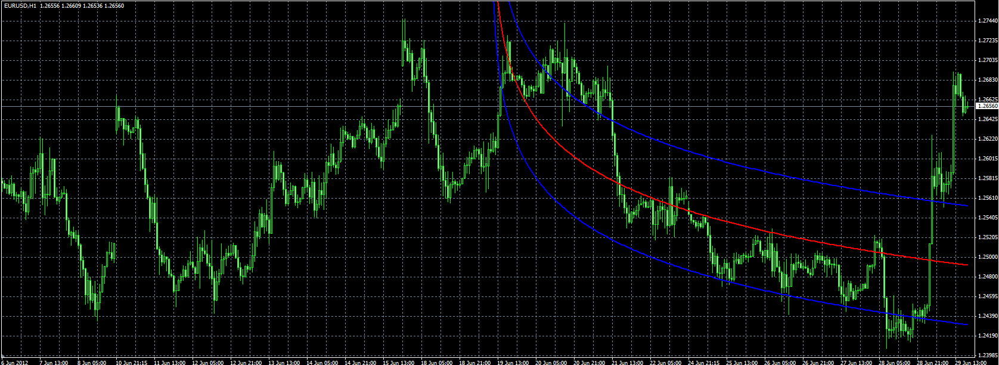

# Logarithmic regression

> Source: https://fxcodebase.com/code/viewtopic.php?f=38&t=20676  
> Forum: 38 · Topic 20676 · 1 post(s)

---

## Logarithmic regression

**Alexander.Gettinger** · Fri Jun 29, 2012 1:36 pm

Indicator looks like Polynomial regression ([viewtopic.php?f=38&t=20393](https://fxcodebase.com/code/viewtopic.php?f=38&t=20393)), but instead of polynomial use a logarithmic function.

 

Download:

 [Logarithmic_Regression.mq4](files/36253/Logarithmic_Regression.mq4)
