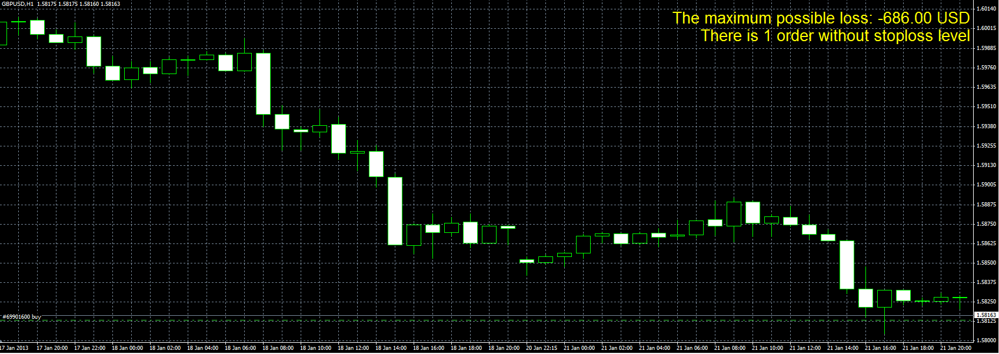

# Loss calculator

> Source: https://fxcodebase.com/code/viewtopic.php?f=38&t=31488  
> Forum: 38 · Topic 31488 · 1 post(s)

---

## Loss calculator

**Alexander.Gettinger** · Mon Jan 28, 2013 4:45 pm

The indicator calculates the maximum loss at the closing of all open order at StopLoss.

 

Download:

 [SL_Calculator.mq4](files/53719/SL_Calculator.mq4)
