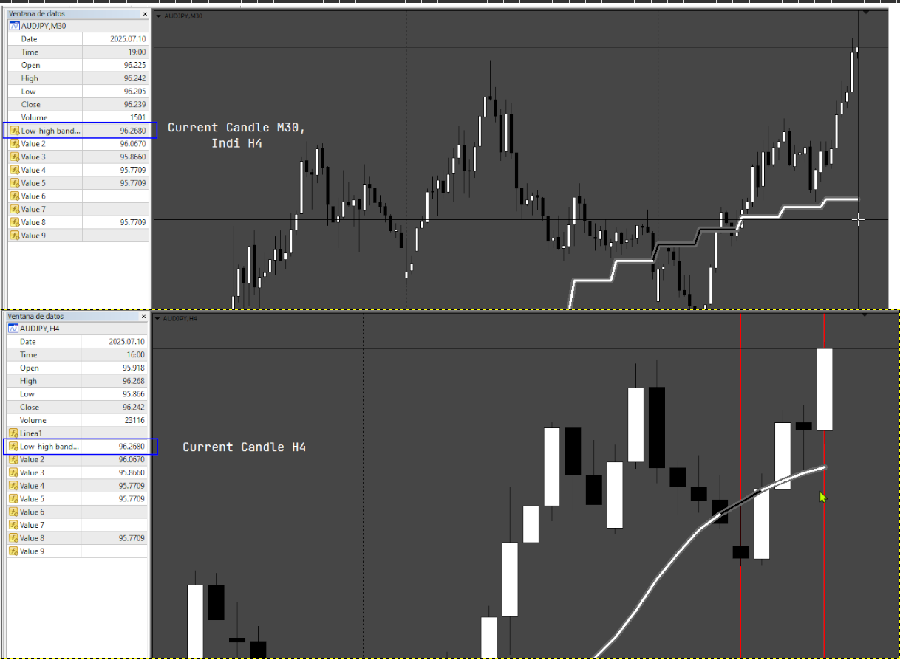
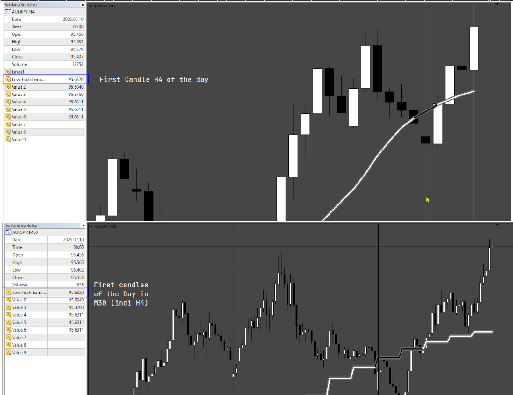
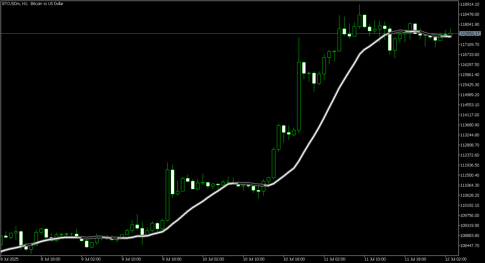

# Low-high_bands_Dashboard

> Source: https://fxcodebase.com/code/viewtopic.php?f=38&t=76113  
> Forum: 38 · Topic 76113 · 5 post(s)

---

## Low-high_bands_Dashboard

**Apprentice** · Wed Jul 02, 2025 4:10 pm

Based on the request.
[https://fxcodebase.com/code/viewtopic.php?f=38&t=76040](https://fxcodebase.com/code/viewtopic.php?f=38&t=76040)

 [Low-high bands_MTF.mq4](files/159824/Low-high%20bands_MTF.mq4)

 [Low-high_bands_Dashboard.mq4](files/159824/Low-high_bands_Dashboard.mq4)

---

## Re: Low-high_bands_Dashboard

**Teruyoshi** · Thu Jul 03, 2025 3:22 am

Thanks for uploading but i am afraid to say there seems to be somethin wrong with mtf function.
Please see the picture attached. I put 4h on 1h chart but slope direction and color doesn't correspond with each other. The same is true of dashboard.
 Is it possible to look into the code and modify both indicators?
Many many thnaks in advance.

---

## Re: Low-high_bands_Dashboard

**Apprentice** · Sun Jul 06, 2025 2:59 am

We have added your request to the development list.
Development reference 444

---

## Re: Low-high_bands_Dashboard

**Apprentice** · Tue Jul 15, 2025 10:58 am

 

---

## Re: Low-high_bands_Dashboard

**Apprentice** · Wed Jul 16, 2025 3:44 am

 [LowHighBand.mq5](files/159936/LowHighBand.mq5)
