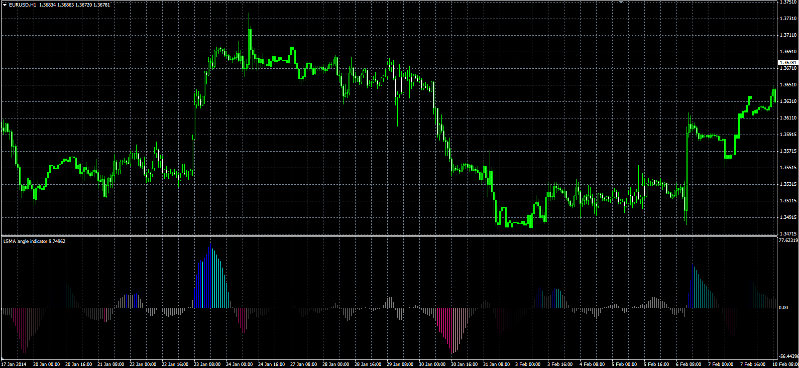

# LSMA Angle oscillator

> Source: https://fxcodebase.com/code/viewtopic.php?f=38&t=60374  
> Forum: 38 · Topic 60374 · 1 post(s)

---

## LSMA Angle oscillator

**Alexander.Gettinger** · Thu Feb 27, 2014 2:47 pm

Original LUA oscillator: [viewtopic.php?f=17&t=60373&p=92938#p92938](https://fxcodebase.com/code/viewtopic.php?f=17&t=60373&p=92938#p92938).

Formulas:
LSMA Angle = mFactor*(fEnd-fStart)/2, where
fEnd[i] = LSMA[i-EndShift],
fStart[i] = LSMA[i-StartShift],
mFactor = 100000/(StartShift-EndShift).

 

Download:

 [LSMA_Angle.mq4](files/92939/LSMA_Angle.mq4)
