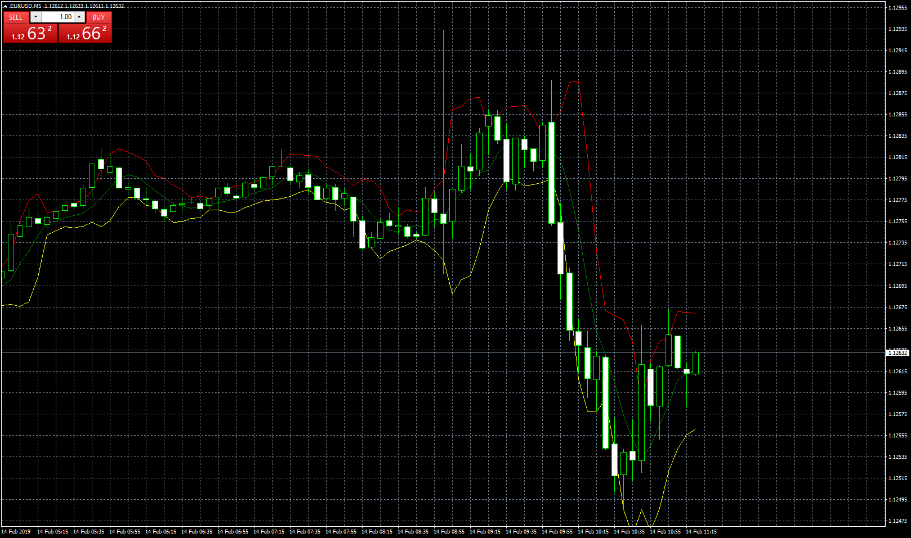

# LTF BB

> Source: https://fxcodebase.com/code/viewtopic.php?f=38&t=67352  
> Forum: 38 · Topic 67352 · 2 post(s)

---

## LTF BB

**Apprentice** · Thu Feb 14, 2019 6:18 am

 [LTF BB.mq4](files/123900/LTF%20BB.mq4)

Showing lower time frames is problematic.
For each candle, we have multiple data points on a lower time frame.
We can use my approach from Lower Time Frame Template.lua

 [LTF Bars BB.mq4](files/123900/LTF%20Bars%20BB.mq4)

---

## Re: LTF BB

**Apprentice** · Tue Feb 19, 2019 5:39 am

LTF Bars BB.mq4 added.
