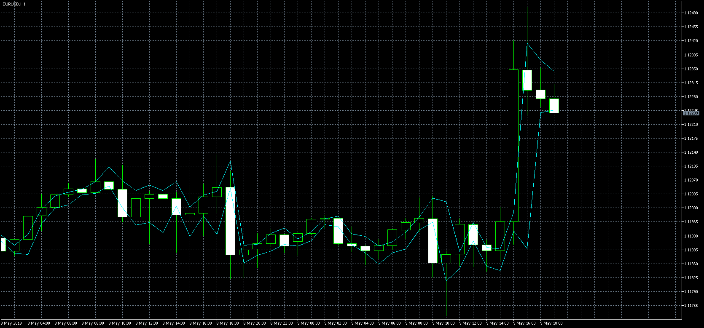
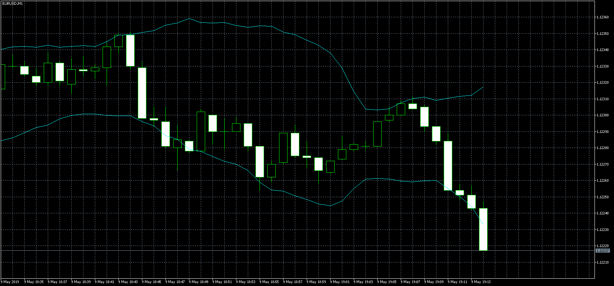

# LTFBB (MT5)

> Source: https://fxcodebase.com/code/viewtopic.php?f=38&t=68443  
> Forum: 38 · Topic 68443 · 6 post(s)

---

## LTFBB (MT5)

**Apprentice** · Thu May 09, 2019 1:10 pm

 

Based on request.
[viewtopic.php?f=27&t=68398](https://fxcodebase.com/code/viewtopic.php?f=27&t=68398)

 [LTFBB.mq5](files/126255/LTFBB.mq5)

---

## Re: LTFBB (MT5)

**Sp2562** · Thu May 09, 2019 7:31 pm

Perfect, thank you.

---

## Re: LTFBB (MT5)

**Sp2562** · Tue Jun 04, 2019 7:45 pm

I need the following adjustment in this indicator.

I need you to turn back a candle and show what was going to happen in the opening of the next candle, in the current candle.

---

## Re: LTFBB (MT5)

**Apprentice** · Wed Jun 05, 2019 6:00 am

Your request is added to the development list under Id Number 4697

---

## Re: LTFBB (MT5)

**Apprentice** · Sat Jun 08, 2019 2:29 am

Try this version.

 [LTFBB v1.1.mq5](files/126785/LTFBB%20v1.1.mq5)

---

## Re: LTFBB (MT5)

**Sp2562** · Sat Jun 08, 2019 9:29 pm

Thanks for the development.

But it did not stay the way I needed it.

Please pick up the original file and delay a candle.

Please do it this way so I can see if it stays the way I need it.

Thank you very much.
