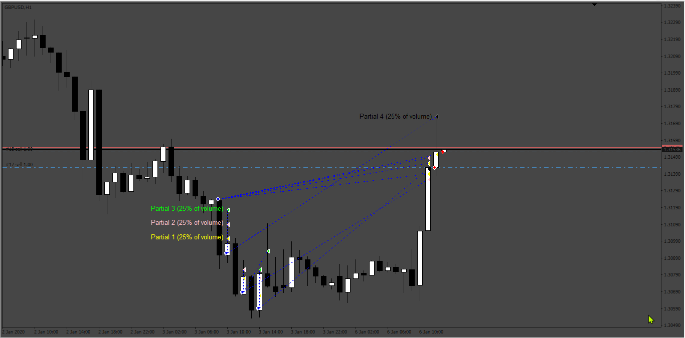
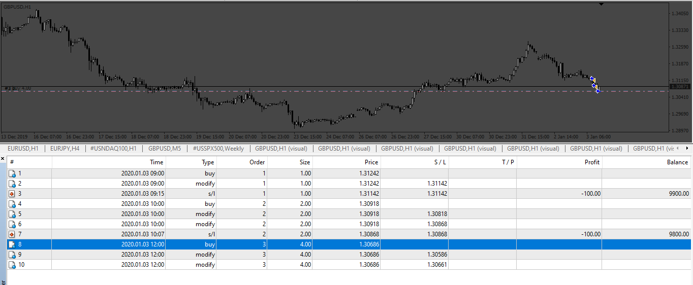
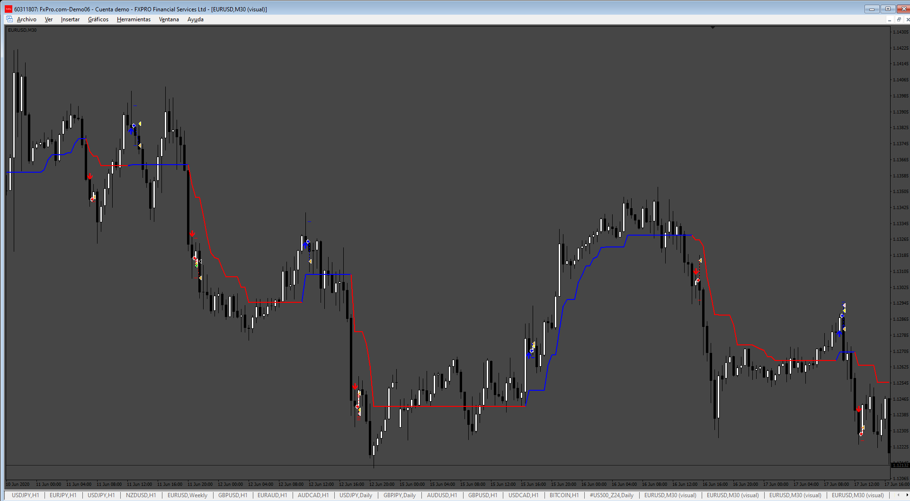
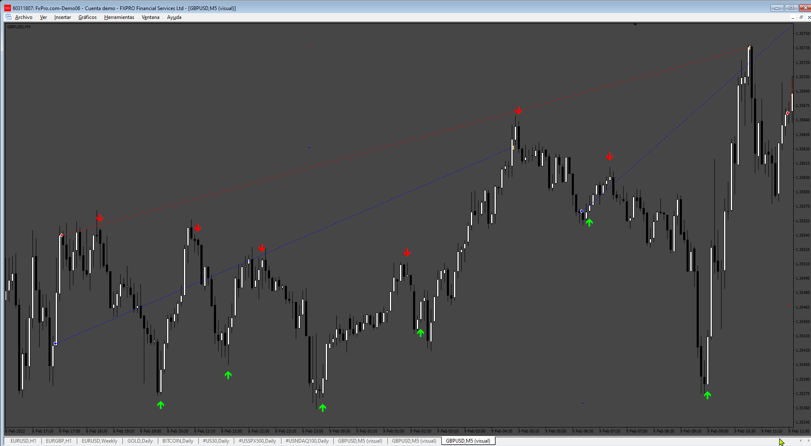
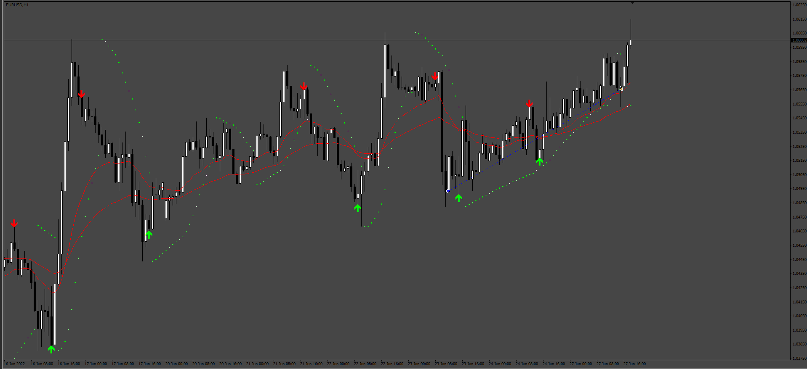

# LUKES_universal_EA_changes

> Source: https://fxcodebase.com/code/viewtopic.php?f=38&t=74877  
> Forum: 38 · Topic 74877 · 30 post(s)

---

## LUKES_universal_EA_changes

**Apprentice** · Fri May 17, 2024 12:40 pm

[40789](files/155365/361_partials_setup.png)

 [40790](files/155365/361_Martingale_Setup.png)

 

 

Based on the request.
[https://fxcodebase.com/code/viewtopic.php?f=27&p=155270](https://fxcodebase.com/code/viewtopic.php?f=27&p=155270)

 [LUKES_universal_EA_changes.mq4](files/155365/LUKES_universal_EA_changes.mq4)

---

## Re: LUKES_universal_EA_changes

**aarkay** · Wed Jul 03, 2024 6:28 am

Hi!

Would be grateful if Max no of Buys and Sells can be added.

Thanks in advance !

-aarkay

---

## Re: LUKES_universal_EA_changes

**Apprentice** · Fri Jul 05, 2024 6:09 am

We have added your request to the development list.
Development reference 552

---

## Re: LUKES_universal_EA_changes

**Apprentice** · Mon Jul 08, 2024 1:25 pm

[LUKES_universal_EA_changes_v2.mq4](files/156047/LUKES_universal_EA_changes_v2.mq4)

Try this version.

---

## Re: LUKES_universal_EA_changes

**aarkay** · Mon Sep 02, 2024 3:59 am

Hi Apprentice !

Thanks a lot !!!

I have a list of further Modifications needed on Luke's Universal EA in addition to the Max number of trades.

This is very similar to what you had done earlier with "Luna_FX_Trading_system_to_EA"
( [https://fxcodebase.com/code/viewtopic.php?f=38&t=74930](https://fxcodebase.com/code/viewtopic.php?f=38&t=74930) )

ENTRY: Market Entry / LIMIT ENTRY (Fibo Retracement Values / ATR retracement / Entry on Open value of signal Candle or % retracement of signal candle). Many times, when the signal comes, price is overextended. That is the reason many indicators fail on automation even if they are very good. So we need to enter at a better price level. OPTION NEEDED to automatically cancel this pending order if a reverse signal comes before filling the order. As in Luna, please give multiple indicator signal entry options.

LOT SIZING: Fixed Lots available. Please give Automatic Lot sizing option based on % risk.

Trend Filter (MTF):

1: MA FILTER (ON/OFF): Choice to enter only in trend direction (If Fast moving average - MA/EMA- is higher than Slow moving Average, then trend is Up, else Down)

2: Specific Trend Filter INDICATOR FIELD with Buffer Codes.

+ Choice to exit on trend reversal of any of these (ON/OFF)

EXIT INDICATOR SIGNAL:
Just like in the LUNA EA, please give independent multiple Indicator signal (arrow) facility to exit a trade IN ADDITION to the opposite signal of the main entry signal. This is for Exit Insurance.

PIPS & ATR:
Luke doesn't have TP/Breakeven/SL/Trailing in PIPS & ATR. Kindly put these options. It is very very tiring, adjusting and calculating.

Thanks a lot, once again. You are amazing !

- Aarkay

---

## Re: LUKES_universal_EA_changes

**Apprentice** · Sun Sep 08, 2024 4:08 pm

We have added your request to the development list.
Development reference 701

---

## Re: LUKES_universal_EA_changes

**aarkay** · Sun Sep 08, 2024 11:14 pm

> **Apprentice wrote:**
> We have added your request to the development list.
> Development reference 701

Thank you Apprentice, I forgot to add a simple request:

Kindly add a "COMMENTS" field so that we can add comments to help identify trades later on.

Best regards

_aarkay

---

## Re: LUKES_universal_EA_changes

**aarkay** · Thu Oct 10, 2024 9:10 am

Dear Apprentice,

It's been more than 1 month. But so far nothing has been done.

Donation was already done for the EMA Angle request but which is not functioning as desired.

Can you kindly confirm if my requests for Luke is possible or not? Time is important for everyone.

Thanks.

- aarkay

---

## Re: LUKES_universal_EA_changes

**Apprentice** · Tue Oct 22, 2024 11:14 am

Try this version.

 [LUKES_universal_EA_changes_v3.mq4](files/157041/LUKES_universal_EA_changes_v3.mq4)

---

## Re: LUKES_universal_EA_changes

**aarkay** · Tue Oct 22, 2024 10:31 pm

Dear Apprentice,

Thanks a lot.

However the EA is not entering trades.

Could you kindly rectify?

- aarkay

---

## Re: LUKES_universal_EA_changes

**Apprentice** · Thu Oct 31, 2024 8:49 am

We have added your request to the development list.
Development reference 823

---

## Re: LUKES_universal_EA_changes

**Apprentice** · Mon Dec 30, 2024 7:26 pm

 [LUKES_universal_EA_changes_v4.mq4](files/157636/LUKES_universal_EA_changes_v4.mq4)

---

## Re: LUKES_universal_EA_changes

**trtrader** · Mon Dec 30, 2024 9:15 pm

can we get SuperArrow.ex4?

---

## Re: LUKES_universal_EA_changes

**Apprentice** · Mon Jan 06, 2025 9:05 am

This SuperArrow.ex4?
[https://fxcodebase.com/code/viewtopic.p ... w.#p156228](https://fxcodebase.com/code/viewtopic.php?f=38&t=75033&p=156228&hilit=SuperArrow.#p156228)

Can you elaborate?

---

## Re: LUKES_universal_EA_changes

**jollyjegan** · Tue Mar 04, 2025 1:22 pm

> **Apprentice wrote:**
>
>
> 823.png
>
>
>
>
> LUKES_universal_EA_changes_v4.mq4

 Kindly Add the "custom comment" in inputs tab.

 convert MQL5 format (MT5) with same options ..

Thanks in advance

---

## Re: LUKES_universal_EA_changes

**Apprentice** · Mon Mar 10, 2025 2:54 pm

We have added your request to the development list.
Development reference 183

---

## LUKES Universal EA + Trailing Stop Loss Options (2025)

**taiko360** · Mon Mar 10, 2025 4:18 pm

Hello Coders,

I have in mind to add some features on an existing free EA named LUKES_universal_EA_changes_v4.mq4

The EA is an automator which open and close orders relatively to the signals of a chosen main indicator that has buffer numbers.

I do want to test several non repaiting indicators on various assets - timeframes.

Some of the requested features are in 2 files I send you:

> FX Combiner v5.2.1-pub.ex4: a free automator EA with interesting options relative to when the EA shall consider the occuring signal
 on the first candle (value=0), on the next candle (value=1), etc.

> Trailing with partial close.ex4: a free EA aiming to help manual scalping with various options of trailing stops,
that I wish to add to an automator in order to have more flexibility in quality testing process.

> RCombiner v2.6.1 Indicator
 This indicator gives statistics of winning and lossing signals.
 Question is: based on what ?..
 In the parameters, there is no way to define a SL, a TP, a specific trailing stop strategy...
 The idea is to improve that by adding much more criterias to allow stats to be more precise.

---------------------------------------------------------------------

--------| Opening or closing a position

New position is opened or closed on the open or the close of the chosen candle

New position is opened on the candle bar where the signal occured or at the next bar (+1) or 2 bars after (+2)

>> That feature is integrated in the automator EA attached (FX Combiner v5.2.1-pub) till 4 candles after signal occured...
 but that automator does not open position on many of the indicators I have tested... which is weird.

--------| Stop Loss & Take Profit Options:

a/ Hard TP & Hard SL: one single value with one decimal (ex: TP: 24.6 pips and SL 12,8 pips)

b/ TP & SL are defined with an ATR defined with custom values of period, multiplier, timeframe
 Visible parameters: ATR TP - ATR SL - ATR Period - ATR Multiplier - ATR Timeframe

c/ Slippage max value: if slippage current value is beyond the max value,
 the EA would check if the on going profits are enough to cover the cost of closing the position.
 If it is the case, the EA will close the position immediatly at 100%.

Max Slippage: if slippage current value is beyond the max value, the EA would not open a new position.

Max Orders

Close on opposite signal

Magic Numbers

Expert Comment

--------| Trailing options & sub-options

A/ Trails immediatly the stop loss from its initial position behind the entry point

 - by steps: trailing by step: every time the price move (x) pips, then move the SL of (x) pips too.

 - relative to an Moving Average: trailing relative to any Moving Average: SMA, EMA, HMA, VWAP, HMMA, Hull, ecc.

 - from ATR: trailing from ATR (period, multiplier and timeframe)
 One could chose the H1 ATR on a 5mn chart with custom ATR period and multiplier values.

B/ SL moves to secure the position against loss first

1- SL at BE
 To Breakeven After (a specific amount of pips price move):
 ex: a value of 10 would mean that the Stop Loss will move to BE after a price of 10 pips

2- SL at BE + (x) pips

 To Breakeven After + Pips:
 ex: a value of 4 would mean the Stop Loss will be moved to Breakeven + 4 pips

3- SL at BE + (x) pips first then trailing is activated

 ->> start only when the Stop Loss has been moved beyond Breakeven entry level + (x) pips after a specific price move of (x) pips.

 Once the Stop Loss is secured so that no losses are possible, then the same 3 options of trailing are given to user:

 ->> by steps, relative to an MA, from ATR

 - by steps: trailing by step: every time the price move (x) pips, then move the SL of (x) pips too.

 - relative to an MA: trailing relative to any Moving Average: SMA, EMA, HMA, VWAP, HMMA, Hull, ecc.

 - from ATR: trailing from ATR (period, multiplier and timeframe)
 One could chose the H1 ATR on a 5mn chart with custom ATR period and multiplier values.

4 -- Move the SL to TP pre-defined thresholds

Move the SL at TP Threshold of user choice when price reach (x) pips

Move the SL at TP Threshold 1 when price reached TP 2

Move the SL at TP Threshold 2 when price reached TP 3

5 -- Move the SL to TP pre-defined thresholds + trailing options

Once the SL has moved to a chosen TP level defined by the user, the 3 trailing options are added as a choice (by steps, from MA, ATR).

--------| Active Hours

Days of trading | Scrolling List: Monday, Tuesday, Wednesday, Thursday, Friday

Week-end | True - False

Close all positions at a specific hour | True - False

Hour:

--------| News

Use News filter: On/Off
Minutes Before News:
Minutes After News:
Include: low, medium, high, speeches, holidays
Allow updates:
Update hour:

Remarks color Gray
Forecast color 170,170,170
Positive forecast color 46,188,46
Negative forecast color Tomato
Show vertical lines
Low impact color 91,192,222
Medium impact Color 255,185,83
High impact Color 217,83,79
Font type from Fonts installed on the OS
Font size

--------| Filtering

7 slots for 7 differents indicators to filter the signals of the main one.
Each slot is dedicated for one specific indicator with his buffer numbers.
The EA named Fx Combiner v5.2.1 shows other parameters relative to which candles the signals should be considered:
candle n°1, the next one, the next next one, etc.

How many confirmation a signal Entry

How many confirmation a signal Exit

Indicator 1 Entry Settings

Indicator 1 - Enable
Timeframe 0 (by dafault = current timeframe in use)
Indicator 1 - File Name
Inficator 1 - File Name
Indicator 1 - Buy Buffer
Indicator 1 - Sell Buffer
Indicator 1 - Bar0 or Intrabar
Indicator 1 - Bar 1
Indicator 1 - Bar 2

Indicator 1 Exit Settings
Timeframe 0 (by dafault = current timeframe in use)
Indicator 1 - File Name
Inficator 1 - File Name
Indicator 1 - Buy Buffer
Indicator 1 - Sell Buffer
Indicator 1 - Bar0 or Intrabar
Indicator 1 - Bar 1
Indicator 1 - Bar 2

2,3,4,5,6,7....

--------| Alerts

Pop Up Alerts

Email Alerts

Custom Sound Alert for new opened position (mp3 or wave format)

Custom Sound Alert for new closed position (mp3 or wave format)

Custom Sound Alert for TP thresholds (1 or 2 or 3) touched by the price

--------| Statistics (from signals opened and closed)

A super great additionnal feature allowing to determine the % of wins and loose for a specific set of parameters for a specific asset / timeframe.
It seems that there are no indicator testing feature delivering precise stats for a given indicator and that's a pitty.

I have added the indicator named R2 Combiner 2.6 1 to this message that show some stats from a defined indicator BUT....
it does not consider any Take Profit, Stop Loss and Trailing parameters. How it consider a signal to be a win or a loss is out of my comprehension.

For example, if I want precise stats for a given indicator - asset - timeframe combo with a specific strategy of TP & SL + options,
it is not yet possible. Such a tool would be a game changer allowing to test the same indicator with various choices to find a resilient configuration.

Timeframe
Numbers of candles

Number and % of win positions (reached Hard TP)
Number and % of loss positions (touched Hard SL)

Number and % of win positions (reached TP1)
Number and % of loss positions (touched TP1)

Number and % of win positions (reached TP2)
Number and % of loss positions (touched TP2)

Number and % of win positions (reached TP3)
Number and % of loss positions (touched TP3)

Panel On/Off
Position of panel | Scrolling list: top left, top right, bottom left, bottom right
Background color of panel
Transparency level of panel
Font color
Font size

Indicator 1 Entry Settings

Indicator 1 - Enable
Timeframe 0 (by dafault = current timeframe in use)
Indicator 1 - File Name
Inficator 1 - File Name
Indicator 1 - Buy Buffer
Indicator 1 - Sell Buffer
Indicator 1 - Bar0 or Intrabar
Indicator 1 - Bar 1
Indicator 1 - Bar 2

Indicator 1 Exit Settings
Timeframe 0 (by dafault = current timeframe in use)
Indicator 1 - File Name
Inficator 1 - File Name
Indicator 1 - Buy Buffer
Indicator 1 - Sell Buffer
Indicator 1 - Bar0 or Intrabar
Indicator 1 - Bar 1
Indicator 1 - Bar 2

2,3,4,5,6,7....

--------| Alerts

Pop Up Alerts

Email Alerts

Custom Sound Alert for new opened position (mp3 or wave format)

Custom Sound Alert for new closed position (mp3 or wave format)

Custom Sound Alert for TP thresholds (1 or 2 or 3) touched by the price

--------| Statistics (from signals opened and closed)

A super great additionnal feature allowing to determine the % of wins and loose for a specific set of parameters for a specific asset / timeframe.
It seems that there are no indicator testing feature delivering precise stats for a given indicator and that's a pitty.

I have added the indicator named R2 Combiner 2.6 1 to this message that show some stats from a defined indicator BUT....
it does not consider any Take Profit, Stop Loss and Trailing parameters. How it consider a signal to be a win or a loss is out of my comprehension.

For example, if I want precise stats for a given indicator - asset - timeframe combo with a specific strategy of TP & SL + options,
it is not yet possible. Such a tool would be a game changer allowing to test the same indicator with various choices to find a resilient configuration.

Timeframe
Numbers of candles

Number and % of win positions (reached Hard TP)
Number and % of loss positions (touched Hard SL)

Number and % of win positions (reached TP1)
Number and % of loss positions (touched TP1)

Number and % of win positions (reached TP2)
Number and % of loss positions (touched TP2)

Number and % of win positions (reached TP3)
Number and % of loss positions (touched TP3)

Panel On/Off
Position of panel | Scrolling list: top left, top right, bottom left, bottom right
Background color of panel
Transparency level of panel
Font color
Font size

------------------------------------

I wish to add Multi Time Frame controls for entries.
Perhaps on a futur update.

Please consider with attention all the features I am asking here.
These would become a game changer for this automator EA.

---

## Re: LUKES_universal_EA_changes

**taiko360** · Tue Mar 11, 2025 3:50 pm

I have also tested the version 3 of LUKES universal and it does not open trades relatively to the signals given by 2 indicators with buffer numbers.

That's a pitty..

---

## Re: LUKES_universal_EA_changes

**Apprentice** · Thu Mar 13, 2025 5:25 am

We have added your request to the development list.
Development reference 190

---

## Re: LUKES_universal_EA_changes

**Apprentice** · Sun Mar 16, 2025 1:49 pm

Task 193

 [LUKES_universal_EA_v3_with_2_Indi.mq4](files/158637/LUKES_universal_EA_v3_with_2_Indi.mq4)

---

## Re: LUKES_universal_EA_changes

**Apprentice** · Wed Apr 16, 2025 2:59 am

Task 190

 [LUKES_universal_EA_v3_TSL.mq4](files/158973/LUKES_universal_EA_v3_TSL.mq4)

---

## Re: LUKES_universal_EA_changes

**Apprentice** · Fri Aug 01, 2025 4:52 am

Task 183

 [LUKES_universal_EA_changes_v4.mq4](files/160090/LUKES_universal_EA_changes_v4.mq4)

---

## Re: LUKES_universal_EA_changes

**jollyjegan** · Sat Oct 04, 2025 1:46 pm

> **Apprentice wrote:**
>
>
> The attachment **190.png** is no longer available
>
>
> Task 193
>
>
> The attachment **190.png** is no longer available

have doubt abt indicator location,

 If the indicator kept under Market folder or some other folder , how to mention the location in universal ea ?

 

*indicator in some other folders*

---

## Re: LUKES_universal_EA_changes

**Apprentice** · Sat Oct 04, 2025 2:34 pm

\AppData\Roaming\MetaQuotes\Terminal\BB190E062770E27C3E79391AB0D1A117\MQL4\Indicators

---

## Re: LUKES_universal_EA_changes

**jollyjegan** · Sun Oct 05, 2025 6:10 am

> **Apprentice wrote:**
> \AppData\Roaming\MetaQuotes\Terminal\BB190E062770E27C3E79391AB0D1A117\MQL4\Indicators

hai..

i tried possible methods to add custom indicator . but its not loaded. failed.

kindly check screenshot & clarify me if any mistake ..

 

*Error on loading cutom folder , custom indicator*

---

## Re: LUKES_universal_EA_changes

**jollyjegan** · Thu Oct 09, 2025 12:28 am

> **Apprentice wrote:**
> \AppData\Roaming\MetaQuotes\Terminal\BB190E062770E27C3E79391AB0D1A117\MQL4\Indicators

Thanks..it works...

---

## Re: LUKES_universal_EA_changes

**hkabakolu** · Fri Nov 21, 2025 12:05 pm

> **Apprentice wrote:**
>
>
> 361_partials_setup.png
>
>
>
>
> 361_Martingale_Setup.png
>
>
>
>
> 361_Partials.png
>
>
>
>
> 361_martingale_test.png
>
>
> Based on the request.
> [https://fxcodebase.com/code/viewtopic.php?f=27&p=155270](https://fxcodebase.com/code/viewtopic.php?f=27&p=155270)
>
>
> LUKES_universal_EA_changes.mq4

hello is there anyone who can help me
I want a martingale here. However, I would like to request that the condition in the second image be removed. You can only set the martingale and multiplier settings. If the first and second transactions are the same lot and the third lot is the same, can you start the multiplier?

---

## Re: LUKES_universal_EA_changes

**hkabakolu** · Fri Nov 21, 2025 12:11 pm

I want a martingale here. However, I would like to request that the condition in the second image be removed. You can only set the martingale and multiplier settings. If the first and second transactions are the same lot and the third lot is the same, can you start the multiplier?

I want to remove the conditional clause here and have the input for the first and second transactions be 0.01 and 0.01, respectively, and the martingel multiplier for the next transaction. Is this possible? I'm asking you. I don't know how to write code. Please help.

---

## Re: LUKES_universal_EA_changes

**Apprentice** · Sat Nov 22, 2025 4:26 pm

We have added your request to the development list.
Development reference 745

---

## Re: LUKES_universal_EA_changes

**Apprentice** · Mon Nov 24, 2025 1:25 pm

[LUKES_universal_EA_changes_v2.mq4](files/161293/LUKES_universal_EA_changes_v2.mq4)

Try this version.
