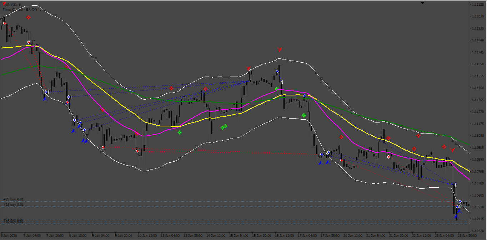

# Luna_FX_Trading_system_to_EALuna_FX_Trading_system_to_EALuna

> Source: https://fxcodebase.com/code/viewtopic.php?f=38&t=74930  
> Forum: 38 · Topic 74930 · 1 post(s)

---

## Luna_FX_Trading_system_to_EALuna_FX_Trading_system_to_EALuna

**Apprentice** · Thu May 30, 2024 1:14 pm

Based on the request.
[https://fxcodebase.com/code/viewtopic.p ... 79#p155479](https://fxcodebase.com/code/viewtopic.php?f=27&p=155479#p155479)

 [LunaM1.ex4](files/155572/LunaM1.ex4)

 [LunaM2.ex4](files/155572/LunaM2.ex4)

 [LunaM3.ex4](files/155572/LunaM3.ex4)

 [100__Non_Repaint_Indicator_V22.0.ex4](files/155572/100__Non_Repaint_Indicator_V22.0.ex4)

 [Luna_FX_Trading_system_to_EA.mq4](files/155572/Luna_FX_Trading_system_to_EA.mq4)
