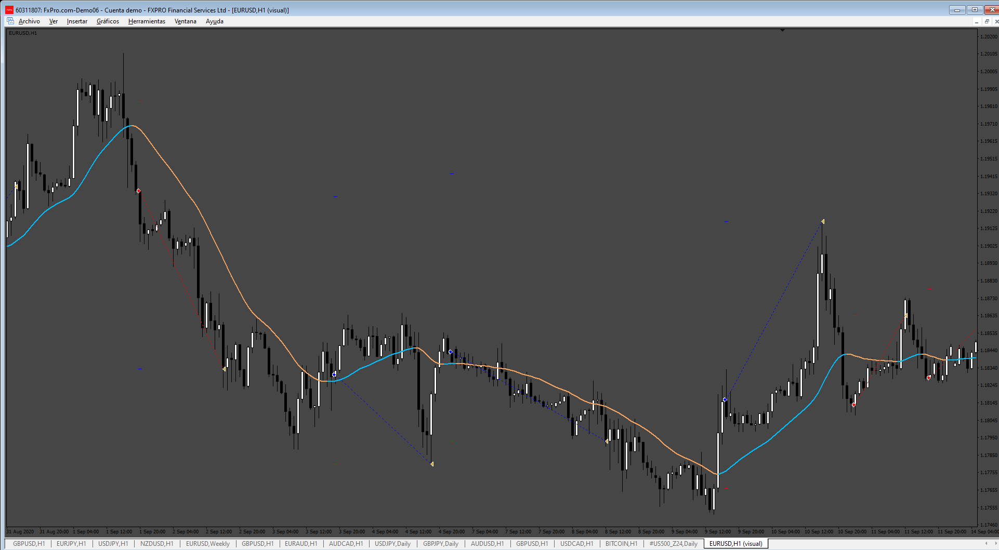

# LWMA_EA

> Source: https://fxcodebase.com/code/viewtopic.php?f=38&t=75488  
> Forum: 38 · Topic 75488 · 7 post(s)

---

## LWMA_EA

**Apprentice** · Sun Jan 12, 2025 3:08 pm

Based on the request.
[https://fxcodebase.com/code/viewtopic.p ... 85#p157585](https://fxcodebase.com/code/viewtopic.php?f=38&p=157585#p157585)

 [lwma.mq5](files/157773/lwma.mq5)

 [LWMA_EA.mq5](files/157773/LWMA_EA.mq5)

 [LWMA.mq4](files/157773/LWMA.mq4)

 [LWMA_EA.mq4](files/157773/LWMA_EA.mq4)

---

## Re: LWMA_EA

**[email protected]** · Tue Jan 14, 2025 12:17 am

Hi. None of these 4 files compile and an error is displayed when I want to compile files.

---

## Re: LWMA_EA

**agungnl** · Mon Jan 20, 2025 3:44 am

> **[[email protected]](https://fxcodebase.com/cdn-cgi/l/email-protection) wrote:**
> Hi. None of these 4 files compile and an error is displayed when I want to compile files.

Hi,
Just add double quotes at property version like this
**#property version "1.0"**

---

## Re: LWMA_EA

**Apprentice** · Mon Jan 20, 2025 4:04 pm

[LWMA.mq4](files/157919/LWMA.mq4)

 [LWMA_EA.mq4](files/157919/LWMA_EA.mq4)

 [lwma.mq5](files/157919/lwma.mq5)

 [LWMA_EA.mq5](files/157919/LWMA_EA.mq5)

---

## Re: LWMA_EA

**[email protected]** · Sat Jan 25, 2025 6:37 am

> **Apprentice wrote:**
>
>
> LWMA.mq4
>
>
>
>
> LWMA_EA.mq4
>
>
>
>
> lwma.mq5
>
>
>
>
> LWMA_EA.mq5

Hi. Your work is excellent.
 Please add a multi-timeframe (MTF) filter for MT4 and MT5 EA versions.
For example, in order to open a buy position, in addition to changing the direction of the indicator in the lower time frame, a buy signal must have already been issued in the higher time frame.
In order to open a sell position, in addition to changing the direction of the indicator in the lower time frame, a sell signal must have already been issued in the higher time frame.
Choosing a higher time frame filter as an option is determined by the trader (Inputs), for example M15. M30, H1, H4 and ...

also add input options.

1-CLOSE ON OPPOSITE signal for Higher time frame and lower time frame (TRUE AND FALSE)Separately.
 and open opposite position (TRUE AND FALSE).
2- Buy only, sell only, buy and sell option.
3-PROFIT PER DAY BY CURRENCY (TRUE AND FALSE)
4-LOSE PER DAY BY CURRENCY (TRUE AND FALSE)
5-Max spread
6-Trade Hours limits each day.
Thanks in advance.

---

## Re: LWMA_EA

**Apprentice** · Sat Feb 01, 2025 4:55 pm

We have added your request to the development list.
Development reference 78

---

## Re: LWMA_EA

**Apprentice** · Tue Feb 11, 2025 5:12 am

[LWMA_EA_v1.00.mq4](files/158205/LWMA_EA_v1.00.mq4)

 [LWMA_EA_v1.00.mq5](files/158205/LWMA_EA_v1.00.mq5)
