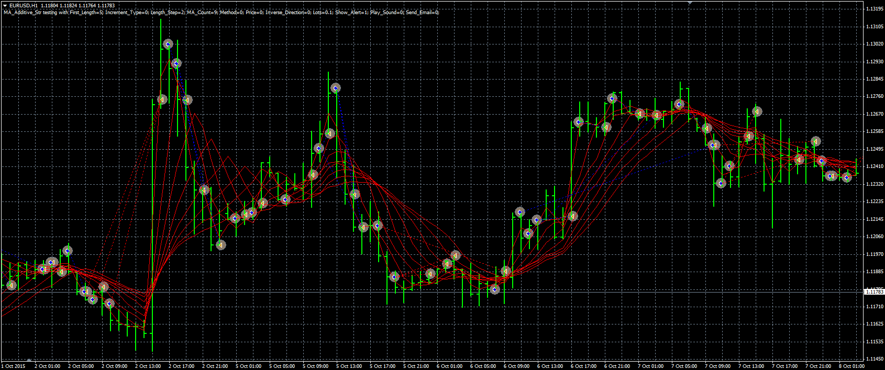

# MA additive strategy

> Source: https://fxcodebase.com/code/viewtopic.php?f=38&t=63304  
> Forum: 38 · Topic 63304 · 1 post(s)

---

## MA additive strategy

**Alexander.Gettinger** · Fri Mar 25, 2016 5:23 pm

This strategy looks like Fan MA strategy ([viewtopic.php?f=38&t=63284](https://fxcodebase.com/code/viewtopic.php?f=38&t=63284)), but it works several orders of one direction, adding them after each new crossing MA.

 

Download:

 [MA_Additive_Str.mq4](files/105484/MA_Additive_Str.mq4)
