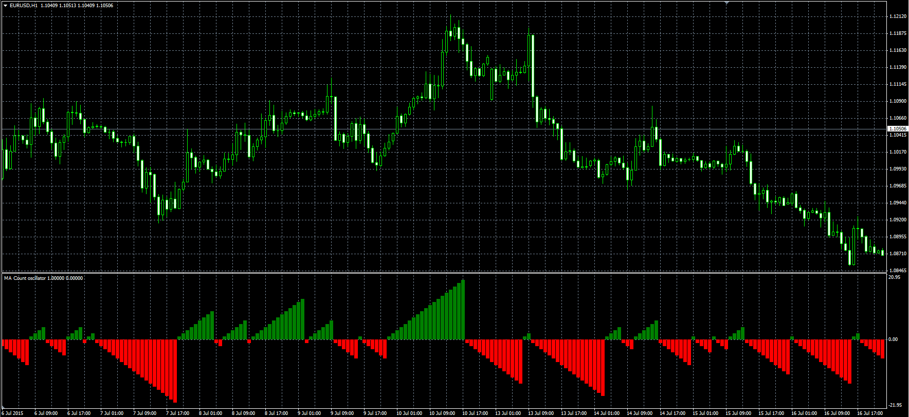

# MA Count oscillator

> Source: https://fxcodebase.com/code/viewtopic.php?f=38&t=62487  
> Forum: 38 · Topic 62487 · 1 post(s)

---

## MA Count oscillator

**Alexander.Gettinger** · Wed Jul 29, 2015 7:44 am

The indicator resets to zero when price crossing the MA.
If Price>MA, Indicator>0,
If Price<MA, Indicator<0.

 

Download:

 [MA_Count.mq4](files/101596/MA_Count.mq4)
