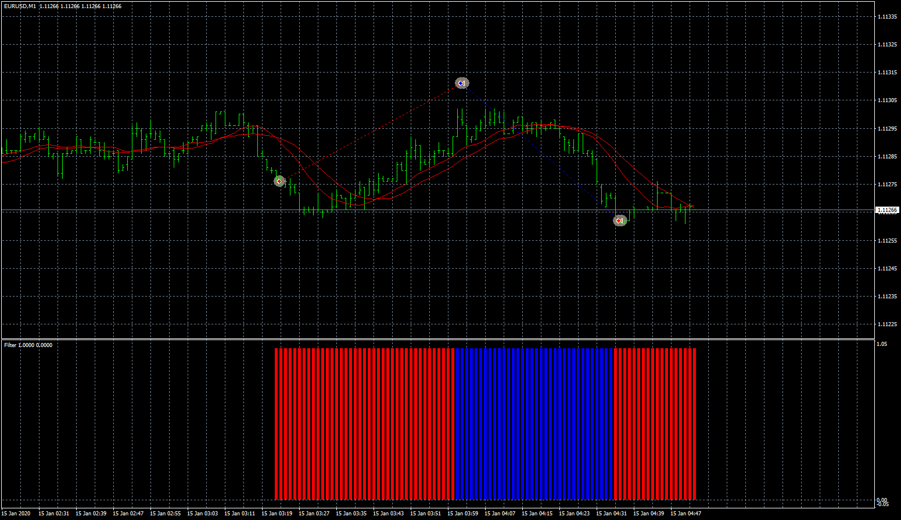

# MA Cross EA With JokerFilter

> Source: https://fxcodebase.com/code/viewtopic.php?f=38&t=70444  
> Forum: 38 · Topic 70444 · 4 post(s)

---

## MA Cross EA With JokerFilter

**Apprentice** · Thu Sep 17, 2020 3:11 am

Based on request
[viewtopic.php?f=38&p=137596](https://fxcodebase.com/code/viewtopic.php?f=38&p=137596)

 [Filter.ex4](files/137664/Filter.ex4)

 [MA Cross EA With JokerFilter.mq4](files/137664/MA%20Cross%20EA%20With%20JokerFilter.mq4)

---

## Re: MA Cross EA With JokerFilter

**interestingfacts** · Thu Sep 24, 2020 11:23 am

Hello Team,
This EA is working fine, according to the logic...
I want u to add, one more small logic in it...

You have given Logic Type: Direct/Reversal.
Direct type is working fine,
but coming to Reversal type, there is a small change...

Logic should be,
If MA Crossover is giving Buy Trend,Place a buy order at the begining of next candle, when filter changes from Blue bar to Red Bar.
If MA Crossover is giving Sell Trend,Place a sell order at the begining of next candle, when filter changes from Red bar to Blue Bar.
Here, if "close on opposite order" is "TRUE", then EA should close these particular orders at the next MA Crossover.

Thank you.

---

## Re: MA Cross EA With JokerFilter

**Apprentice** · Sat Sep 26, 2020 1:53 am

Your request is added to the development list.
Development reference 2104.

---

## Re: MA Cross EA With JokerFilter

**Apprentice** · Mon Oct 26, 2020 4:59 am

[MA_Cross_EA_With_JokerFilter_ver1.mq4](files/138485/MA_Cross_EA_With_JokerFilter_ver1.mq4)

Try this version.
