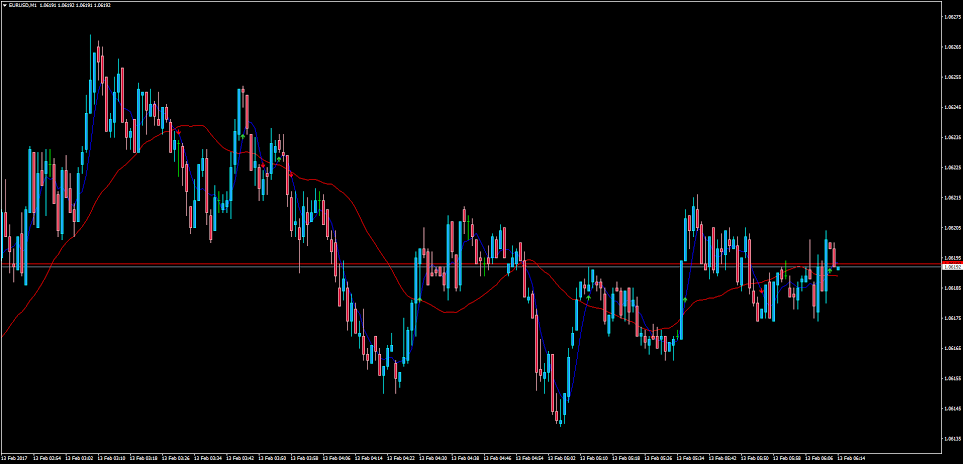

# MA CROSS Indicator

> Source: https://fxcodebase.com/code/viewtopic.php?f=38&t=64419  
> Forum: 38 · Topic 64419 · 4 post(s)

---

## MA CROSS Indicator

**Ehab.Ali** · Tue Feb 07, 2017 8:53 am

i found this indicator on the forum
and i edit on it to show cross arrow

now please can you help me to make an advanced modification

1- change the alert message to show the symbol name and time frame
**example : USDJPY 30M CROSS HAPPENED**

2- I'M ON TIME FRAME 1H AND WHEN CROSS HAPPENED IT WILL ALERT ME,
CAN IT ALERT WHEN OTHER FRAMES 15M OR 30M CROSS HAPPENED WHILE I OPEN THE 1H ?
**IF YES**
THEN CAN YOU MAKE AN OPTION TO SELECT FROM INDICATOR SETTINGS 2 TIMEFRAME BESIDE THE CURRENT OPENED

**example : i'm on current (30m) and select from settings to watching the 1m and 15 m
now i'm waiting alert from indicator if cross happened on (current time frame"30M" AND both time frames selected on indicator settings"1M" AND "5M")**

can it be done ?
INDICATOR ATTACHED
and i'm sorry for the long ask
 really thanks a lot for your efforts

 [Custom - MA CROSS.mq4](files/110952/Custom%20-%20MA%20CROSS.mq4)

---

## Re: MA CROSS Indicator

**Apprentice** · Thu Feb 09, 2017 1:44 pm

Your request is added to the development list, Under Id Number 3736
 If someone is interested to do this task, please contact me.

---

## Re: MA CROSS Indicator

**Apprentice** · Mon Feb 13, 2017 11:17 am

Try it now.

---

## Re: MA CROSS Indicator

**Ehab.Ali** · Wed Feb 15, 2017 1:33 pm

> **Apprentice wrote:**
> Try it now.

hank you very very much

i'm working on it now and will report you if any thing but i think its working perfect

thanks a lot
