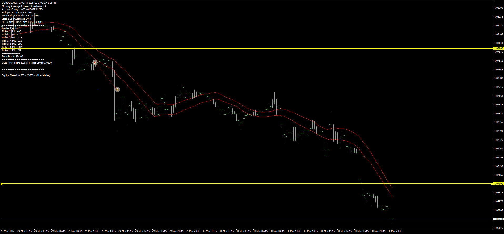

# MA Crosses Price EA

> Source: https://fxcodebase.com/code/viewtopic.php?f=38&t=64930  
> Forum: 38 · Topic 64930 · 1 post(s)

---

## MA Crosses Price EA

**Apprentice** · Tue Jul 18, 2017 4:59 am

Based on the request.
[viewtopic.php?f=27&t=64809](https://fxcodebase.com/code/viewtopic.php?f=27&t=64809)
Description:

Entry:

Buy: When moving average low (setting = 1) crosses User defined price level
Sell: When moving average high (setting = 1) crosses User defined price level

Exit:

Exit buy when low crosses in opposite direction of the price level. Otherwise hold forever or until manually closed.
Exit sell when high crosses in opposite direction of the price level. Otherwise hold forever or until manually closed.

 [MA_Crosses_Price.mq4](files/113597/MA_Crosses_Price.mq4)
