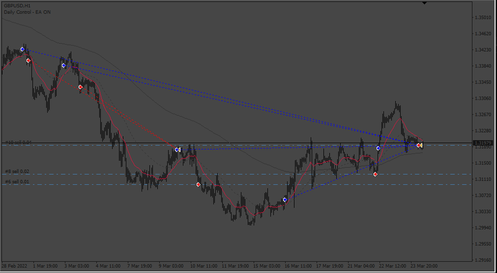
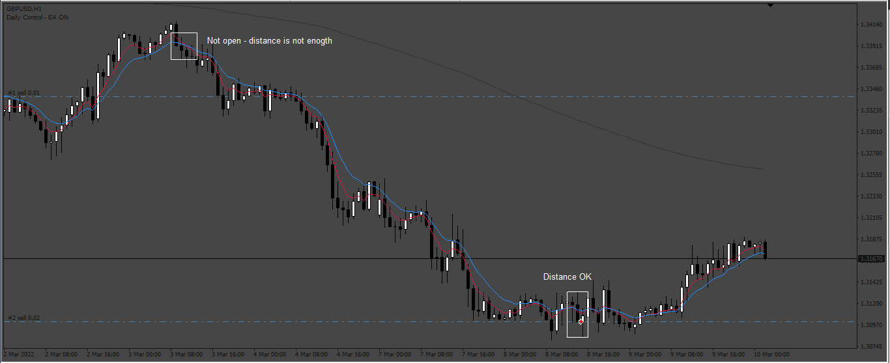
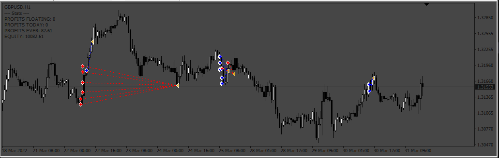
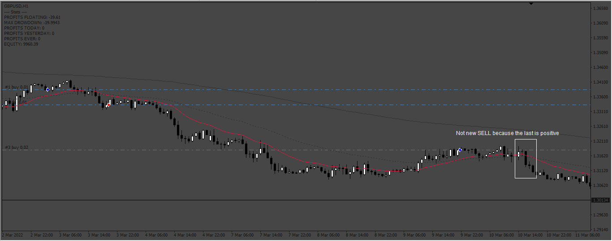
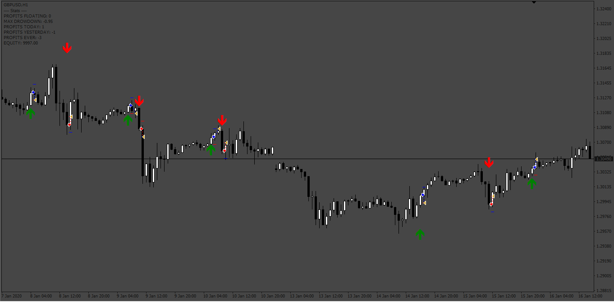

# MA_Crossover_EA

> Source: https://fxcodebase.com/code/viewtopic.php?f=38&t=74582  
> Forum: 38 · Topic 74582 · 14 post(s)

---

## MA_Crossover_EA

**Apprentice** · Thu Feb 01, 2024 1:32 pm

Based on the request.
[https://fxcodebase.com/code/viewtopic.php?f=38&t=74561](https://fxcodebase.com/code/viewtopic.php?f=38&t=74561)

 [MA_Crossover_EA.mq4](files/154242/MA_Crossover_EA.mq4)

---

## Re: MA_Crossover_EA

**psjohn** · Sun Feb 04, 2024 8:24 am

Thank you so much Apprentice and FXCodeBase team. But it seems the "Min Pips Between Orders" doesn't work as what I expected. The pips gap should be between concecutive (similiar) orders. Such as shown on the picture below, the gap between buy order #19 and concecutive buy order #20 is almost 0 instead 1000 (which I put in the setting).

However for opposite order (between buy and sell) no rule needed for minimum pips gap.

---

## Re: MA_Crossover_EA

**Apprentice** · Tue Feb 06, 2024 11:56 am

We have added your request to the development list.
Development reference 112

---

## Re: MA_Crossover_EA

**Apprentice** · Sat Feb 10, 2024 11:40 am

 [MA_Crossover_EA.mq4](files/154346/MA_Crossover_EA.mq4)

---

## Re: MA_Crossover_EA

**psjohn** · Sun Feb 18, 2024 10:05 am

Thank you dear Apprentice. I'm doing some backtestings and request some queries to improve the perfomance:
1. In the Grid Setup, please kindly add option to "Open another position on loss". So the new position for concecutive (similar) order will be opened if the previous order is negative.
2. Please account stats on chart to monitor equity, running loss/profit, today drawdown, overall drawdown, etc.

Thank you.

---

## Re: MA_Crossover_EA

**Apprentice** · Sat Feb 24, 2024 2:52 pm

We have added your request to the development list.
Development reference 187

---

## Re: MA_Crossover_EA

**Apprentice** · Sun Mar 03, 2024 7:26 am

 [MA_Crossover_EA.mq4](files/154570/MA_Crossover_EA.mq4)

---

## Re: MA_Crossover_EA

**psjohn** · Fri Mar 08, 2024 10:52 am

Thank you so much dear Apprentice for your hardwork. The EA works but not as what I expected. Let me elaborate a little bit what I expect.

The new trade in the Martingale Setup must be opened when EMA crossover signal appears, and can only be opened if the previous similar trade is negative (loss). In Martingale Setup, the next trade can only be opened when meets this criteria:
1. It is triggered by EMA crossover signal
2. The pip gap is met
3. The previous similar trade is negative (loss). As example, "Buy" trade will only be opened when previous "Buy" trade is negative (loss), without caring about the "Sell" trades. If "Buy" trade is positif (profit), the next "Buy" will not be opened even though the EMA crossover signal has appeared and the pip gap is met.

Please kindly add option in the Martingale Setup to chose "Open another position on loss". You have this function in your other EA (ADX crossing lines) as shown in picture below.

May I also ask if you can add information for "Yesterday Profit" and "Highest Drawdown" in the stats?

Thank you again for your kind help.

---

## Re: MA_Crossover_EA

**Apprentice** · Sat Mar 09, 2024 10:15 am

We have added your request to the development list.
Development reference 206

---

## Re: MA_Crossover_EA

**Apprentice** · Mon Mar 11, 2024 2:10 pm

 [MA_Crossover_EA_v2.mq4](files/154645/MA_Crossover_EA_v2.mq4)

---

## Re: MA_Crossover_EA

**psjohn** · Tue Mar 12, 2024 11:50 pm

Thank you so much dear Apprentice for your generosity to build this EA, I hope I can repay your kindness near soon.

Best regards,
PS John

---

## Re: MA_Crossover_EA

**Tarkish195** · Mon May 20, 2024 11:01 am

MA_Crossover_EA_v2.mq4 is an excellent EA. Would it be possible to modify this EA. Use Scalping_X2, which is a custom indicator, to send signals instead of using the MA lines?

---

## Re: MA_Crossover_EA

**Apprentice** · Wed May 22, 2024 1:50 pm

We have added your request to the development list.
Development reference 416

---

## Re: MA_Crossover_EA

**Apprentice** · Thu May 30, 2024 2:26 pm

 [MA_Crossover_EA_Scalper_x2_v1.0.mq4](files/155577/MA_Crossover_EA_Scalper_x2_v1.0.mq4)
