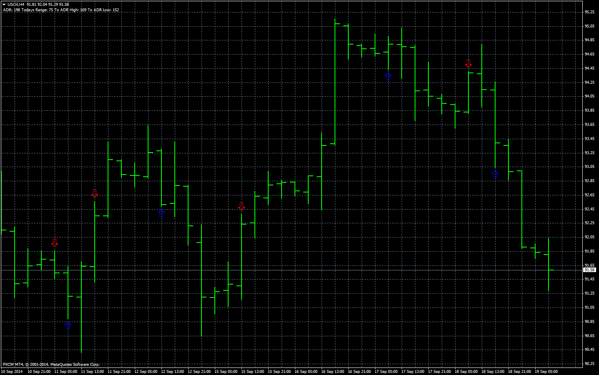

# MA CrossOver

> Source: https://fxcodebase.com/code/viewtopic.php?f=38&t=61178  
> Forum: 38 · Topic 61178 · 5 post(s)

---

## MA CrossOver

**Apprentice** · Fri Sep 19, 2014 4:23 am

The signal is generated on the basis of a cross between two data streams.

First stream is the difference between Fast and Slow moving average.
The second stream is a moving average of First Data Stream (signal line)

 [MA CrossOver.mq4](files/96006/MA%20CrossOver.mq4)

---

## Re: MA CrossOver

**jay1994** · Sat Sep 20, 2014 2:08 pm

Thank you Apprentice!

---

## Re: MA CrossOver

**sagymmm** · Mon Oct 06, 2014 8:54 pm

Hello, can I have an indicator that gives audio alerts when the candle closes above or below an EMA and sends emails too
Thx

---

## Re: MA CrossOver

**Apprentice** · Tue Oct 07, 2014 11:06 am

Your request is added to the development list.

---

## Re: MA CrossOver

**sagymmm** · Mon Dec 08, 2014 9:20 pm

Hello, I wish that I will be hearing good news soon related to my request
Thanks
