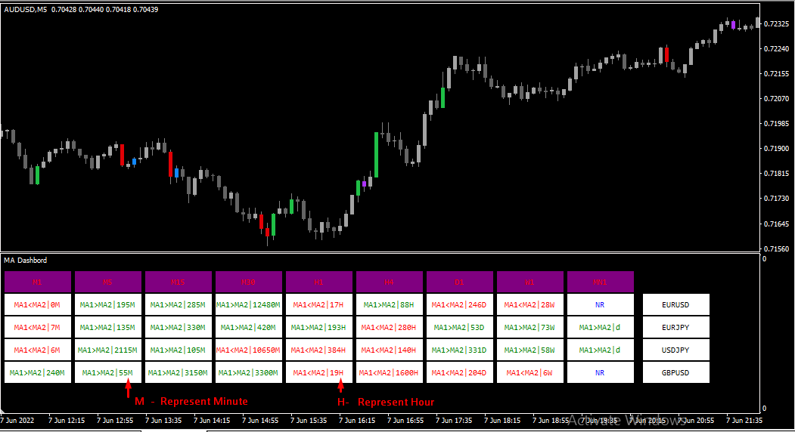
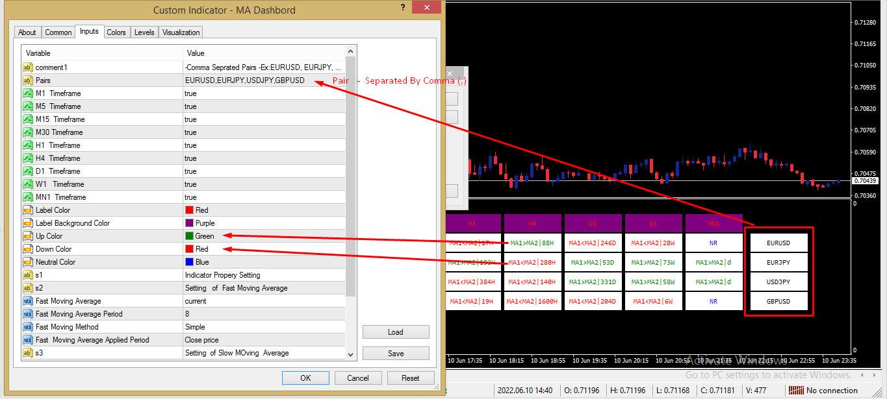

# MA_Dashbord

> Source: https://fxcodebase.com/code/viewtopic.php?f=38&t=72404  
> Forum: 38 · Topic 72404 · 6 post(s)

---

## MA_Dashbord

**Apprentice** · Mon Jun 20, 2022 11:09 am

 

Based on the TS2 version.
[https://fxcodebase.com/code/viewtopic.php?f=17&p=145320](https://fxcodebase.com/code/viewtopic.php?f=17&p=145320)

 [MA_Dashbord.mq4](files/146427/MA_Dashbord.mq4)

---

## Re: MA_Dashbord

**Honest_Trader** · Tue Jun 21, 2022 11:32 pm

Yet another great dashboard from Apprentice Lab. Thank you kindly.

Just a query : Will this work only for Forex, because I input non-forex instrument like stock/commodity nothing shows up in the MT4.

Thanks
GK

---

## Re: MA_Dashbord

**Apprentice** · Thu Jun 23, 2022 1:53 am

We have added your request to the development list.
Development reference 381

---

## Re: MA_Dashbord

**Honest_Trader** · Thu Jun 23, 2022 10:55 am

Thank you Apprentice.

---

## Re: MA_Dashbord

**Apprentice** · Mon Jul 18, 2022 4:23 am

[35543](files/146784/MA_Dashboard_Setting.png)

Yes, it should work on non-forex instrument, Just go through market and add it.

---

## Re: MA_Dashbord

**Honest_Trader** · Mon Jul 18, 2022 10:47 am

Thanks mate.

~GK
