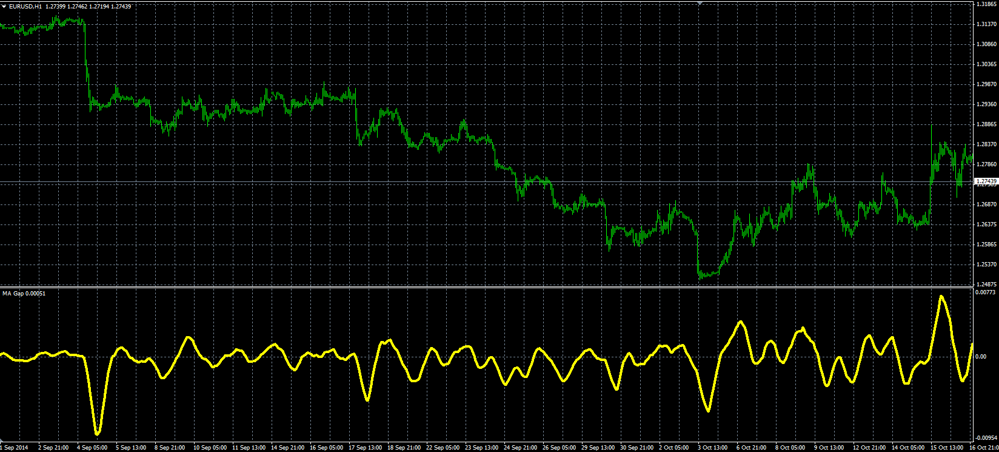

# MA Gap

> Source: https://fxcodebase.com/code/viewtopic.php?f=38&t=61455  
> Forum: 38 · Topic 61455 · 1 post(s)

---

## MA Gap

**Alexander.Gettinger** · Mon Nov 17, 2014 5:19 pm

Original LUA oscillator: [viewtopic.php?f=17&t=22582](https://fxcodebase.com/code/viewtopic.php?f=17&t=22582).

> This indicator will show the Absolute, Relative Pips or the difference between two moving averages.

 

Download:

 [MA_Gap.mq4](files/97128/MA_Gap.mq4)
