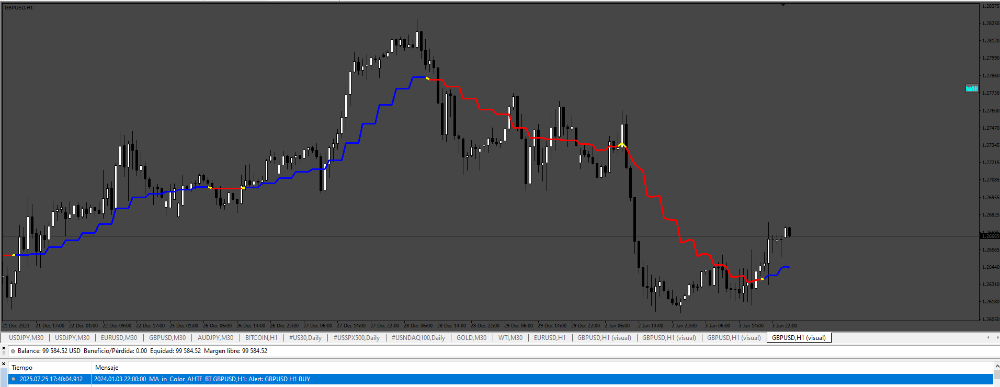

# MA_in_Color_AHTF_BT

> Source: https://fxcodebase.com/code/viewtopic.php?f=38&t=76187  
> Forum: 38 · Topic 76187 · 4 post(s)

---

## MA_in_Color_AHTF_BT

**Apprentice** · Sun Jul 27, 2025 12:30 pm

Based on the request.
[https://fxcodebase.com/code/viewtopic.p ... 08#p160008](https://fxcodebase.com/code/viewtopic.php?f=27&p=160008#p160008)

 [MA_in_Color_AHTF_BT.mq4](files/160033/MA_in_Color_AHTF_BT.mq4)

---

## Re: MA_in_Color_AHTF_BT

**egg999** · Mon Jul 28, 2025 5:27 am

> **Apprentice wrote:**
>
>
> 479.png
>
>
> Based on the request.
> [https://fxcodebase.com/code/viewtopic.p ... 08#p160008](https://fxcodebase.com/code/viewtopic.php?f=27&p=160008#p160008)
>
>
> MA_in_Color_AHTF_BT.mq4

Dear Apprentice,
Thank you for the modification. But unfortunately it doesn't give sound alerts.
Could you please add sound alert on it? Thanks again.
Regards,

---

## Re: MA_in_Color_AHTF_BT

**Apprentice** · Tue Jul 29, 2025 5:37 am

We have added your request to the development list.
Development reference 485

---

## Re: MA_in_Color_AHTF_BT

**Apprentice** · Mon Aug 04, 2025 3:49 am

[MA_in_Color_AHTF_BT.mq4](files/160120/MA_in_Color_AHTF_BT.mq4)

Try this version.
