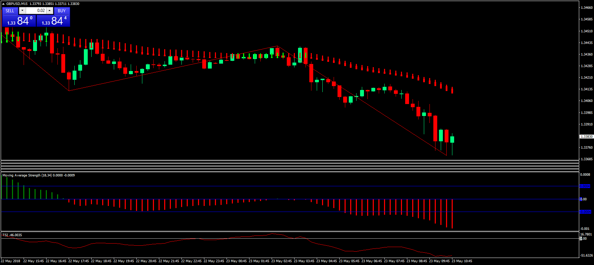

# MA, MACD or Stochastic strength

> Source: https://fxcodebase.com/code/viewtopic.php?f=38&t=66139  
> Forum: 38 · Topic 66139 · 4 post(s)

---

## MA, MACD or Stochastic strength

**bartwas1** · Wed May 23, 2018 5:01 am

Hi,
I'd like to share this oscillator. You may choose three different options: MACD, stochastic or MA strengths to be displayed, but only one can be active at any given time. I've shared this mostly because of moving average strength. Original settings are: 13 and 21, however when set at: 18-fast (you may tweak this maybe into 20?) and 34-slow, the oscillator seem to be more accurate and tend to avoid early/premature price movement. It's useful for to determine swings, you can use it with zigzag (12,5,3) and TSI (10,16) to trade long or short.

Bart

 [moving-average-strength.mq4](files/119348/moving-average-strength.mq4)

---

## Re: MA, MACD or Stochastic strength

**Gilles** · Sun Jun 14, 2020 4:16 am

Hi Apprentice,

Please a LUA version.

Thank you :)

---

## Re: MA, MACD or Stochastic strength

**Apprentice** · Sun Jun 14, 2020 7:22 pm

Your request is added to the development list.
Development reference 1478.

---

## Re: MA, MACD or Stochastic strength

**Apprentice** · Mon Jun 15, 2020 5:54 am

Try this version.
[viewtopic.php?f=17&t=70021&p=134958#p134958](https://fxcodebase.com/code/viewtopic.php?f=17&t=70021&p=134958#p134958)
